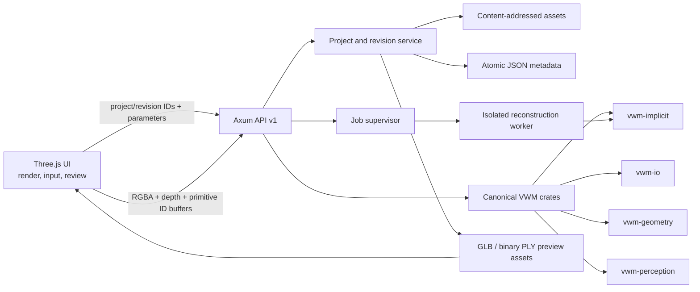
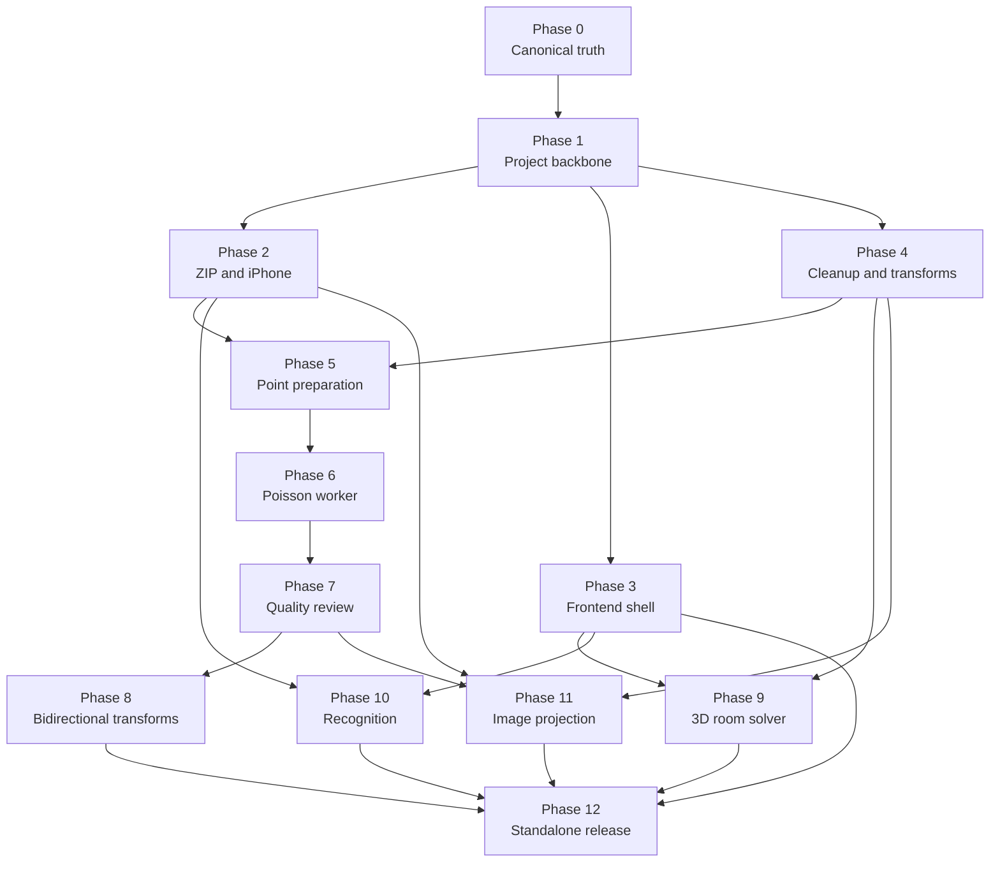

# 3DMk VWM feature merge plan

**Status:** Implementation in progress; Phases 0 and 1 complete, Phase 2 package ingest/review complete, engine and offline UI lanes remain  
**Plan date:** 2026-07-18  
**Target application:** `C:\Users\Scott Birse\Documents\3DMk 2.0`  
**Canonical VWM source:** `VWM-Repo-Implicit`  
**Supporting audit:** `VWM-Repo-Perception\docs\3dmk-perception-engine-port-plan.md`  
**Supporting reconstruction audit:** `VWM-Repo-Implicit\docs\3dmk-implicit-engine-port-plan.md`

## Navigation

- [Outcome, scope, and current truth](#1-executive-decision)
- [Target architecture and canonical source](#6-target-architecture)
- [Project, revision, asset, and API contracts](#8-authoritative-domain-model)
- [Detailed engine integration](#12-detailed-engine-integration)
- [UI/UX and frontend refactor](#13-ui-and-ux-integration)
- [119-story phased backlog](#17-phased-implementation-backlog)
- [Dependencies and requirement traceability](#18-dependency-graph-and-execution-lanes)
- [Tests, fixtures, performance, and diagnostics](#19-detailed-acceptance-strategy)
- [Migration, rollback, risks, and Definition of Done](#22-migration-and-rollback)
- [First execution batch](#25-first-execution-batch)

## 1. Executive decision

3DMk should merge the useful VWM work as one coherent, revision-based product rather than expose a collection of unrelated engine buttons.

The merge has five hard architectural decisions:

1. **Use one VWM source.** `VWM-Repo-Implicit` is the corrected superset containing `vwm-core`, `vwm-io`, `vwm-geometry`, `vwm-perception`, and the implicit reconstruction crates. The root application will repoint its path dependencies to it. The older `vwm-workspace\VWM-Repo` and the standalone perception copy remain read-only reference copies until the new source passes all gates; they are not runtime dependencies.
2. **Use one Rust service.** The existing Axum router remains the backend for both browser development and Tauri. Tauri continues to start that router on a loopback ephemeral port. No second implementation using Tauri commands will be created.
3. **Make projects and revisions authoritative.** Imported source data is immutable. Cleanup, leveling, smoothing, reconstruction, sampling, texture projection, and accepted structural edits each create a traceable child revision or a versioned analysis document. The browser will pass IDs and operation parameters instead of uploading a lossy ad-hoc PLY for every action.
4. **Make evidence visible.** A detection is not complete until its exact source geometry, confidence, provenance, and proposed action are visible and reviewable in the 3D canvas. “Structure analysis,” “room extraction,” and “object recognition” remain separate capabilities.
5. **Gate every reconstructed surface on measured quality.** Producing triangles is not success. A result must pass geometry, residual, coverage, component, normal, and visual regression gates before the UI offers it as an acceptable revision.

This is a dependency-ordered implementation plan, not a claim that the features are already merged.

## 2. Product outcome

The completed product will let a user:

- open a mesh, point cloud, ordinary model package, or supported iPhone scan archive;
- see exactly which assets, textures, camera records, and point blocks were found or missing;
- clean floating scan artifacts through visible Keep, Remove, and Uncertain candidates;
- level and smooth geometry without silently discarding colors, UVs, materials, source images, camera calibration, measurements, or history;
- create a reviewed surface from a point cloud in Rust and compare it directly with the source;
- sample a mesh back to a point cloud in Rust while retaining available color, normals, and source-face provenance;
- derive walls, corners, and room cycles from 3D structural evidence rather than from one arbitrary horizontal slice;
- run local ONNX object recognition and see the contributing pixels, faces, or points for each proposed object;
- project calibrated photos onto new geometry, initially as confidence-weighted vertex color and later as a proper texture bake when that separate gate is passed;
- save the complete project as a validated ZIP package containing source assets, revisions, analyses, measurements, room plans, recognition decisions, images, calibration, quality reports, and provenance;
- run the same capabilities in the standalone Tauri application without a development server or internet connection.

## 3. Scope and non-goals

### 3.1 In scope

- Canonical VWM source convergence.
- Rust-owned import, validation, ZIP extraction, processing, export, and long-running jobs.
- Filesystem-backed project, asset, revision, analysis, and operation records.
- Mesh and point-cloud attribute preservation.
- Artifact analysis and reversible cleanup.
- Alignment, smoothing, point-cloud preparation, Screened Poisson reconstruction, and quality gates.
- Mesh-to-point-cloud sampling.
- 3D structural room inference with evidence overlays and manual correction.
- Local ONNX object recognition with multiview evidence fusion.
- iPhone capture archive parsing and calibrated image projection.
- Task-first UI integration, state modularization, and a single right-side dock.
- Offline Tauri packaging, launch diagnostics, and release verification.

### 3.2 Explicit non-goals for this merge

- Cloud processing, accounts, collaboration, or multi-user synchronization.
- A database before filesystem metadata proves insufficient.
- Training a proprietary foundation model.
- A general-purpose CAD kernel rewrite.
- Automatic deletion of geometry without user review.
- Calling deterministic color segmentation “object recognition.”
- Calling contrast adjustment “image-assisted refinement.”
- Pretending a fabricated progress percentage describes an opaque Poisson solve.
- A React rewrite. The existing Three.js application will be modularized incrementally.
- A new proprietary scene format unless measured loading or storage limits prove GLB and binary PLY inadequate.
- A headless Rust renderer in the first merge. Three.js may produce view and ID buffers; inference and geometry decisions still run in Rust.
- Silent planar UV generation as a substitute for texture preservation or rebaking.
- A schedule expressed in calendar dates before team capacity and fixture runtimes are known. Story points below express relative size and risk, not elapsed time.

## 4. Current-state truth table

| User-visible capability | Current implementation | Current truth | Merge disposition |
|---|---|---|---|
| Point cloud to mesh | `/api/point-cloud-to-mesh` calls `run_pdal_pipeline` | PDAL is absent; mocked success did not prove quality | Replace with canonical VWM preparation plus isolated Screened Poisson worker and quality review |
| Mesh to point cloud | Primarily browser-side behavior | Not a Rust-owned, revisioned transform | Implement deterministic, area-weighted Rust sampling |
| Floating artifact cleanup | `scene.rs` classifies Keep/Remove/Uncertain clusters | Useful analysis exists, but exact geometry decisions are not committed as revisions | Preserve the analysis, expose exact masks/overlays, add reviewed cleanup commits |
| Structural detection | Geometry heuristics emit planes and categories | This is deterministic structure analysis, not semantic recognition | Keep and label accurately |
| Object recognition | No production ONNX workflow is connected | Not implemented | Port `vwm-perception`, add view/ID capture, fusion, overlays, and review |
| Surface leveling | Rust returns a transform; browser applies it | Export path can lose attributes and backend output is lossy | Make Rust produce an attribute-preserving revision and transform camera poses |
| Smoothing | Rust computes positions; browser copies them into existing geometry | Visual attributes can survive in memory, but provenance and project history do not | Make a same-topology Rust revision with exact attribute retention |
| Room plan | Single horizontal triangle slice and polyline chaining | Does not establish walls, corners, or rooms reliably | Remove from production workflow; retain only as optional diagnostic evidence |
| Image refinement | Sharpness/contrast scoring changes existing texture contrast | No calibrated projection or geometry refinement occurs | Relabel as image quality assessment or disable; implement calibrated projection |
| ZIP import/export | JSZip loads and builds packages in browser memory | Some limits exist, but ambiguity, extraction safety, memory use, and manifest truth are inadequate | Move package parsing, validation, asset storage, and export to Rust |
| Texture preservation | Frontend sometimes retains original Three.js material state | Processing files and remeshing can drop UVs/materials/textures | Preserve assets by digest; define topology-preserving and topology-changing policies |
| Measurements | Independent sets, units, editable points exist | Useful frontend feature, but anchors are world points and are not revision-aware | Preserve UI; migrate anchors to revision and primitive provenance |
| Tauri standalone | Tauri starts Axum and points a webview at it | External CDN imports and inactive bundling prevent a dependable offline executable | Vendor dependencies, harden localhost, enable bundling, and test clean-machine launch |

## 5. Non-negotiable product rules

### 5.1 Data integrity

- The original imported bytes and first measured revision are immutable.
- Every derived result records its parent revision, operation type, parameters, engine version, start/end timestamps, warnings, and quality report.
- Asset identity is content-addressed with SHA-256. Names are display metadata, not identity.
- A topology-preserving operation must retain vertex/face indexing unless its contract explicitly says otherwise.
- A topology-changing operation must never claim that old UVs, material assignments, primitive anchors, or measurements remain valid without an explicit transfer report.
- Unit conversion for display does not rescale canonical geometry. Explicit scale correction is a separate, recorded operation.
- Failures and cancellations never publish a partial revision.

### 5.2 User trust

- No backend capability is represented by a Boolean that merely means a route exists.
- Capability status is one of `available`, `degraded`, `unavailable`, or `experimental` and includes a reason and dependency evidence.
- Every automated finding has a visible source overlay and a confidence or deterministic score.
- Uncertain geometry is never removed automatically.
- The user can reject an operation without damaging the source.
- The UI never calls a heuristic classification “ML,” “AI,” “recognition,” or “high quality” unless that claim is technically true and benchmarked.
- The room workflow never labels open traces as rooms.

### 5.3 Processing ownership

- Rust owns package I/O, geometry transformation, filtering, reconstruction, sampling, analysis, inference, projection, quality metrics, persistence, and export.
- JavaScript owns rendering, input, workflow presentation, selection, and collection of view buffers requested by Rust.
- JavaScript may perform transient visual interpolation or camera animation, but cannot become a second production geometry engine.

## 6. Target architecture



### 6.1 Runtime topology

| Deployment | Startup | Backend URL | Processing |
|---|---|---|---|
| Browser development | `agentic-cad-backend serve` | Fixed loopback development port, currently 8181 | Same Axum routes and Rust engines |
| Tauri development | Tauri starts the embedded Rust library | Random loopback port | Same Axum routes and Rust engines |
| Tauri release | Standalone executable starts the embedded Rust library | Random loopback port with per-launch session protection | Same Axum routes and Rust engines; no internet required |

There will be no Tauri-only processing fork. Any feature that works only through a JavaScript fallback is not complete.

### 6.2 Ownership boundaries

| Layer | Owns | Does not own |
|---|---|---|
| `vwm-core` | Geometry arrays, units, transforms, datum, origin, reusable contracts | Project folders, filenames, UI state |
| `vwm-io` | Validated model parsing and writing | ZIP policy, project history |
| `vwm-geometry` | Adjacency, normals, components, reusable geometric algorithms | Product workflow or user decisions |
| `vwm-implicit-*` | Point preparation contracts, field solving, surface extraction | Project persistence, UI acceptance |
| `vwm-perception` | Model loading, tensor preprocessing, inference, mask/source slicing | View rendering and product decisions |
| Root Rust app | Projects, assets, revisions, jobs, packages, room semantics, projection, API, release policy | Browser rendering |
| Frontend | Viewport, input devices, task flows, overlays, selection, review | Authoritative transforms or heavy processing |

## 7. Canonical source convergence

### 7.1 Dependency change

Root `Cargo.toml` will point every VWM dependency to a single tree:

- `VWM-Repo-Implicit/crates/vwm-core`
- `VWM-Repo-Implicit/crates/vwm-io`
- `VWM-Repo-Implicit/crates/vwm-geometry`
- `VWM-Repo-Implicit/crates/vwm-perception`
- `VWM-Repo-Implicit/crates/vwm-implicit-core`
- `VWM-Repo-Implicit/crates/vwm-implicit-poisson`
- `VWM-Repo-Implicit/crates/vwm-implicit-surface-nets` only when its optional gate is approved
- `VWM-Repo-Implicit/crates/vwm-implicit`

No folder rename is required merely for aesthetics. The old copies remain until the new tree passes:

1. VWM workspace format, check, clippy, and test;
2. root backend format, check, clippy, and test;
3. real model import regression;
4. real point-cloud preparation and reconstruction regression;
5. Tauri debug launch.

Only after those gates pass may the old path dependencies be removed. Archiving or deleting old source copies is a separate explicit cleanup action.

### 7.2 Source-to-product feature mapping

| Source capability | Product integration point | Required adaptation |
|---|---|---|
| `CanonicalScene` | Revision scene payload | Add app-level asset references and revision metadata outside the crate |
| `OrientedPointSet` | Prepared reconstruction input | Populate confidence, colors, and source IDs through preprocessing |
| Screened Poisson | Reconstruction worker | Add hard process cancellation, stages, preset mapping, and quality gates |
| Surface Nets | Optional alternate extractor | Keep feature-gated until real fixtures prove value |
| ONNX runner | Object-recognition job | Package licensed models, expose model manifests, and validate tensors |
| Mask-to-source slicing | Recognition evidence | Feed exact face/point ID buffers generated by the viewport |
| Deterministic color segmenter | Test harness only | Never expose as recognition |
| Corrected model loaders | Project import normalization | Wrap with package limits, diagnostics, and immutable asset storage |

## 8. Authoritative domain model

### 8.1 Project

A `Project` is the durable container opened by the UI.

| Field | Contract |
|---|---|
| `project_id` | UUID generated by Rust |
| `schema_version` | Semver-compatible package schema version |
| `name` | User-facing name; not used as a filesystem path |
| `canonical_units` | Metres internally; original declared units and conversion evidence are retained separately. Unknown units require confirmation rather than silent scaling. |
| `source_asset_ids` | Immutable imported files, capture archive, images, textures, and calibration |
| `root_revision_id` | First normalized scene revision |
| `active_revision_id` | Last user-selected revision, not necessarily newest |
| `revision_ids` | Ordered immutable revision references |
| `analysis_ids` | Structure, recognition, quality, room-plan, and image-quality records |
| `measurement_set_ids` | Versioned measurement objects |
| `created_at` / `updated_at` | RFC 3339 UTC; display converts locally |
| `warnings` | Persistent import or compatibility warnings |

### 8.2 Asset

| Field | Contract |
|---|---|
| `asset_id` | UUID |
| `sha256` | Content digest and storage identity |
| `original_name` | Sanitized display name |
| `media_type` | Detected type, not trusted extension |
| `byte_length` | Verified extracted byte length |
| `role` | Source model, texture, photo, calibration, preview, overlay, report, or export |
| `source_path` | Original archive-relative path after normalized validation |
| `created_by` | Import or operation ID |
| `metadata` | Dimensions, EXIF, color space, model counts, or capture index as applicable |

Assets are immutable and deduplicated by digest within a project. A revision references assets; it does not copy or rewrite an original texture.

### 8.3 Revision

| Field | Contract |
|---|---|
| `revision_id` | UUID |
| `parent_revision_ids` | One for ordinary operations; more only for an explicit merge |
| `operation_id` | Operation that produced the revision |
| `scene_kind` | `mesh`, `point_cloud`, or `hybrid` |
| `scene_asset_id` | Authoritative normalized GLB or binary PLY |
| `render_asset_id` | Viewer-ready GLB or binary point preview |
| `attribute_contract` | Which normals, colors, UVs, material IDs, source IDs, and confidence arrays exist |
| `topology_relation` | `same_topology`, `subselection`, `resampled`, `reconstructed`, or `rigid_transform` |
| `source_mapping_asset_id` | Optional mapping from output elements to parent elements |
| `transform` / `datum` / `origin` | Canonical spatial metadata |
| `camera_set_id` | Calibrated cameras in the same frame, if available |
| `quality_report_id` | Required for reconstructed revisions |
| `status` | `candidate`, `accepted`, `accepted_with_warnings`, or `rejected` |
| `created_at` | RFC 3339 UTC |

Initial storage uses GLB for textured meshes and binary PLY for point clouds. A proprietary binary format is deferred until profiling proves it necessary.

### 8.4 Operation

An `Operation` is the reproducibility record.

Required fields:

- operation ID and type;
- input project and revision IDs;
- validated parameter object;
- engine and model versions;
- deterministic seed when applicable;
- started, completed, failed, or cancelled timestamps;
- output revision or analysis IDs;
- structured warnings and errors;
- resource metrics: elapsed time, peak resident memory when measurable, input/output counts;
- parent/child attribute transfer report.

### 8.5 Job

Long-running work is represented as a `Job`:

| Field | Contract |
|---|---|
| `job_id` | UUID |
| `kind` | Import, prepare, reconstruct, recognize, project images, export, or room solve |
| `state` | Queued, running, cancellation requested, cancelled, failed, review required, or complete |
| `stage` | Named honest stage such as validating, orienting normals, solving field, extracting surface, or scoring |
| `progress` | Optional only when the stage has a measurable denominator |
| `elapsed_ms` | Always reported while running |
| `cancel_mode` | Cooperative or process kill |
| `diagnostics` | Structured stage messages safe to show in the UI |
| `temporary_path` | Internal and never exposed as a public download |

The Poisson solve stage is indeterminate with elapsed time. The UI must not invent a percentage.

### 8.6 Analysis and overlay

An `Analysis` is immutable engine output tied to a revision. An `Overlay` is its renderable evidence.

Analysis records include:

- algorithm and version;
- input revision;
- parameters;
- finding IDs;
- score/confidence semantics;
- exact overlay asset IDs;
- source element mapping;
- warnings and limitations.

Large masks are stored as compact assets, not returned as millions of JSON integers. The API returns summary records and overlay URLs.

### 8.7 Measurement set and anchors

Measurements remain independent named objects, not one global sequence.

Each endpoint migrates from a bare world coordinate to:

- source revision ID;
- mesh primitive ID plus barycentric coordinate, or point ID for a cloud;
- fallback world coordinate;
- unit-independent canonical value;
- remap state: exact, transformed, nearest-surface candidate, stale, or unresolved.

Rigid transforms preserve and transform anchors. Same-topology smoothing recomputes positions from primitive anchors. Reconstruction and resampling leave source measurements attached to the source revision unless the user accepts a validated remap. Measurements are never silently cleared.

### 8.8 Room plan and recognized object

A `RoomPlanVersion` contains floor/ceiling planes, wall patches, wall graph, intersections, corners, cycles, openings, confidence, evidence overlays, and user edits. It is tied to a scene revision but does not replace that geometry.

A `RecognizedObjectCandidate` contains label distribution, confidence, contributing view IDs, source element mask, 3D bounds, model manifest, and review state. User decisions are Accept, Rename, Reject, or Needs Review.

## 9. Filesystem layout and atomicity

```text
app-data/
  projects/
    <project-id>/
      project.json
      assets/
        <sha256>/
          asset.json
          payload
      revisions/
        <revision-id>/
          revision.json
          scene.glb | cloud.ply
          render.glb | render.ply
          mapping.bin
      analyses/
        <analysis-id>/
          analysis.json
          overlays/
      measurements/
        <measurement-set-id>.json
      room-plans/
        <room-plan-version-id>.json
      operations/
        <operation-id>.json
      jobs/
        <job-id>.json
      temp/
        <job-id>/
```

All writers use a project-local temporary path, fsync where appropriate, then an atomic rename into the final location. Startup removes abandoned temporary jobs after recording a recovery diagnostic. Published metadata never references a missing final asset.

The initial filesystem store is deliberately simple. Add SQLite only if later requirements demand cross-project search, concurrent writers, or transactional queries that atomic JSON cannot safely provide.

## 10. API v1 contract

### 10.1 Route families

| Method and route | Purpose | Result |
|---|---|---|
| `GET /api/v1/capabilities` | Detect runtime feature maturity and dependencies | Structured capability descriptors |
| `POST /api/v1/projects/import` | Import model or package as a project | Import job ID |
| `GET /api/v1/projects/:id` | Read project summary | Project and active revision |
| `GET /api/v1/projects/:id/revisions` | List revision graph | Revision summaries |
| `POST /api/v1/projects/:id/operations` | Start a validated operation | Job or completed operation |
| `GET /api/v1/jobs/:id` | Poll job state | Stage, elapsed time, progress when measurable |
| `DELETE /api/v1/jobs/:id` | Request cancellation | Accepted cancellation request |
| `GET /api/v1/revisions/:id/render` | Fetch viewer-ready scene | GLB or binary PLY |
| `POST /api/v1/revisions/:id/analyses/structure` | Analyze planes/components | Analysis job |
| `POST /api/v1/revisions/:id/analyses/recognition` | Run ONNX recognition | Analysis job |
| `POST /api/v1/revisions/:id/analyses/room-plan` | Run 3D structural solver | Room-plan job |
| `POST /api/v1/analyses/:id/decisions` | Store review decisions | Decision version |
| `POST /api/v1/analyses/:id/commit` | Commit accepted cleanup | Child revision |
| `POST /api/v1/revisions/:id/view-captures` | Submit render and ID buffers | View capture ID |
| `POST /api/v1/projects/:id/export` | Build a validated package | Export job |
| `GET /api/v1/assets/:id` | Fetch authorized project asset | Streamed asset |

### 10.2 Operation types

The operations endpoint accepts a tagged, versioned parameter object:

- `cleanup_components`
- `level_to_plane`
- `smooth_taubin`
- `prepare_point_cloud`
- `reconstruct_screened_poisson`
- `sample_mesh_to_points`
- `project_images_to_vertices`
- `bake_texture` when enabled
- `apply_scale_correction`

Unsupported operations for the active scene kind return a typed `operation_not_applicable` response rather than a disabled route pretending to work.

### 10.3 Error contract

Every non-success response contains:

- stable error code;
- user-safe message;
- operation/job ID when created;
- field-level validation details;
- retryability;
- diagnostics reference;
- no absolute local filesystem path.

Representative codes include `unsupported_format`, `ambiguous_package`, `archive_limit_exceeded`, `missing_capture_asset`, `invalid_transform_convention`, `model_unavailable`, `quality_gate_failed`, `operation_not_applicable`, `job_cancelled`, and `revision_conflict`.

### 10.4 Compatibility period

Existing routes remain temporarily behind adapters while the first vertical slices move to project IDs. They emit deprecation headers and diagnostics. A route is removed only when:

1. its UI caller has migrated;
2. browser and Tauri tests use the v1 path;
3. saved packages no longer rely on its output;
4. a repository search finds no production caller.

The old `/api/point-cloud-to-mesh` cannot report success through PDAL when PDAL is absent. During migration it returns a clear unavailable/deprecated error directing callers to the revision operation.

### 10.5 Contract specimens

These specimens pin behavior; final OpenAPI generation remains sourced from Rust types.

Capability:

```json
{
  "id": "screened_poisson",
  "status": "experimental",
  "engine_version": "vwm-implicit:<source-revision>",
  "dependencies": [
    {
      "id": "reconstruction_worker",
      "status": "available"
    }
  ],
  "reason": "Engine is connected; real-fixture quality approval is still required.",
  "supported_scene_kinds": ["point_cloud"],
  "requires": ["prepared_normals", "quality_review"]
}
```

Operation request:

```json
{
  "schema_version": "1.0",
  "operation": "smooth_taubin",
  "input_revision_id": "<uuid>",
  "parameters": {
    "iterations": 10,
    "lambda": 0.5,
    "mu": -0.53
  }
}
```

Accepted asynchronous response:

```json
{
  "operation_id": "<uuid>",
  "job_id": "<uuid>",
  "state": "queued"
}
```

Job status during an opaque solve:

```json
{
  "job_id": "<uuid>",
  "state": "running",
  "stage": "solving_field",
  "progress": null,
  "elapsed_ms": 18842,
  "can_cancel": true
}
```

Analysis finding:

```json
{
  "finding_id": "<uuid>",
  "kind": "detached_component",
  "suggested_decision": "remove",
  "score": 0.93,
  "score_semantics": "deterministic_artifact_likelihood_v1",
  "overlay_asset_id": "<uuid>",
  "source_mapping_asset_id": "<uuid>",
  "review_state": "unreviewed",
  "reasons": [
    "disconnected from dominant supported component",
    "low relative point count"
  ]
}
```

## 11. Local service security and resource policy

### 11.1 Tauri loopback protection

- Bind only to loopback.
- Generate a 256-bit random token on each launch.
- Exchange a one-use bootstrap nonce for an HttpOnly, SameSite=Strict session cookie, then remove the nonce from navigation history.
- Validate `Origin` and `Host` for state-changing requests.
- Use a restrictive Content Security Policy; remove `csp: null`.
- Disable development bypasses in release builds.
- Never expose arbitrary filesystem paths through a route.

### 11.2 Import and ZIP limits

Rust import enforces configurable defaults before extraction:

- maximum compressed upload;
- maximum aggregate expanded bytes;
- maximum single-entry expanded bytes;
- maximum entry count;
- maximum path depth and path length;
- maximum compression ratio;
- timeout and cancellation checks;
- reject absolute paths, drive prefixes, `..` traversal, alternate separators that normalize to traversal, symlinks, hardlinks, encrypted entries, and duplicate normalized paths;
- detect content type from bytes, not extension alone;
- report ambiguous model candidates instead of silently picking the first;
- stream files to temporary storage and hash them while writing.

The current browser values—512 MiB compressed, 1 GiB expanded, and 512 entries—become explicit configuration inputs, not implicit trust. Real iPhone fixture sizes determine whether release defaults must be adjusted.

### 11.3 Processing limits

- Per-operation point, vertex, face, image, pixel, and memory estimates are validated before starting.
- Expensive jobs use bounded queues and a configured worker count.
- Request handlers never hold a 1 GiB multipart body and a second complete decoded copy without an explicit memory budget.
- Reconstruction runs out of process for hard cancellation.
- ONNX providers and thread counts are bounded.
- Partial files remain in job temp storage and are removed on failure.

## 12. Detailed engine integration

### 12.1 Import and normalization pipeline

1. Stream upload to a temporary file while hashing.
2. Detect ordinary model versus ZIP package.
3. Validate archive entries and build a manifest of observed assets.
4. Select an explicit adapter:
   - 3DMk package manifest;
   - supported iPhone capture archive;
   - ordinary multi-file model package;
   - single model.
5. Parse the selected model through corrected `vwm-io`.
6. Validate finite values, indices, declared units, bounds, attribute lengths, materials, textures, and coordinate metadata.
7. Preserve every original byte as an immutable source asset.
8. Normalize a canonical revision without discarding colors, normals, UVs, material IDs, datum, origin, or transform.
9. Produce a viewer asset and import report.
10. Publish the project atomically and open it in the UI.

An import with recoverable missing capture frames may complete with warnings. An import with an unreadable primary model or ambiguous primary model requires user resolution.

### 12.2 iPhone capture adapter

The inspected archive `Model Sample files\Untitled_Scan-2026-Jun-23-archive.zip` establishes the initial adapter contract:

- 161 observed entries;
- 79 JSON;
- 74 JPEG;
- 6 log files;
- 1 GLB;
- 1 PNG;
- `Session.json` descriptor claims 84 texture-image records;
- 74 actual image/record pairs are present;
- `RawImages_blocks.json` supplies dimensions, image paths, timestamps, focal length, principal point, 3×3 rotation, and translation;
- raw point descriptor reports 10,030,964 points in 251 blocks with colors and no normals;
- cloud descriptor reports 3,356,976 points in 84 blocks with colors and no normals;
- reconstructed GLB reports 65,123 vertices and 107,611 triangles.

The adapter will:

1. Treat descriptor counts as expected and archive contents as observed.
2. Report the missing ten expected image records as validation warnings.
3. Load `Refined-Mesh-1.glb` as the initial renderable mesh when valid.
4. Preserve all raw/capture metadata even when an engine cannot yet consume every block.
5. Parse camera records into one documented coordinate convention.
6. Verify rotation handedness, translation interpretation, image origin, focal units, and principal-point convention with a reprojection test before calling poses calibrated.
7. Associate each image and JSON record by explicit index/path/UUID, never directory order.
8. Keep GPS and heading as metadata, not geometry truth.
9. Expose capture completeness and calibration validity in the import review.

Raw block payload support is a separate adapter story because the current audit proves descriptors but has not yet demonstrated every referenced point block is present and decodable.

#### Canonical package manifest

Every exported ZIP has one root `3dmk-package.json`. It records:

- package schema and minimum compatible app version;
- project ID, display name, canonical units, and active revision;
- every entry’s normalized path, role, byte length, media type, and SHA-256;
- revision graph, operation provenance, and attribute contracts;
- analyses, overlays, room-plan versions, measurements, and decisions;
- camera set and capture completeness;
- quality reports and warning acknowledgements;
- engine, model, and algorithm versions;
- source archive digest when an archive was imported.

Import validates every listed digest before publishing a project. Unlisted non-metadata entries are warnings or errors according to schema policy; they are never executed. Export ordering and timestamps are normalized where practical so identical project state produces a reproducible package digest.

### 12.3 Component analysis and cleanup

The useful Keep/Remove/Uncertain behavior from `scene.rs` becomes a two-step workflow:

1. **Analyze:** calculate connected components, density/outlier evidence, support relationship, bounds, point/face counts, and suggested classification. Store an exact component mask and colored overlay.
2. **Review and commit:** the user selects Keep, Remove, or Uncertain per candidate. Commit creates a `subselection` child revision and retains a source-element mapping.

Default policy:

- Keep the dominant supported scene.
- Suggest removal only for disconnected, low-support components meeting configured evidence thresholds.
- Mark borderline evidence Uncertain.
- Never auto-commit removal.
- Allow “show only candidate,” “isolate retained scene,” and source/candidate opacity controls.

### 12.4 Point-cloud preparation

Preparation is a distinct revision so it can be inspected before reconstruction:

1. validate finite points, bounds, units, and attributes;
2. compute components and artifact scores;
3. apply only user-approved cleanup;
4. balance sampling density by voxel centroid or deterministic representative selection;
5. preserve color, confidence, and original point IDs;
6. use supplied normals when complete and valid;
7. otherwise estimate normals with PCA neighborhoods;
8. orient normals from calibrated camera rays when available;
9. use graph/MST propagation as fallback;
10. score orientation consistency and expose bad regions;
11. emit `OrientedPointSet` plus preparation report.

Spatial indexing follows evidence:

- begin with the existing voxel approach where it meets accuracy and runtime;
- run a bounded spike comparing a maintained Rust KD-tree or spatial-index crate only if the real fixtures miss the performance budget;
- do not add a dependency merely because it is conventional.

### 12.5 Screened Poisson reconstruction

The user selects an outcome preset rather than raw solver jargon:

| Preset | Intent | Exposed adjustments |
|---|---|---|
| Fast preview | Rapid shape review | Detail level and cleanup strictness |
| Room surfaces | Stable walls/floors from room scans | Surface support, thin-feature retention, hole policy |
| Object detail | Selected object or compact scan | Detail, smoothing, support threshold |

The backend maps these presets to versioned `PoissonConfig` values and records the expanded values.

Execution:

1. parent job validates a prepared point revision;
2. parent writes worker input and operation metadata to a job temp directory;
3. `3dmk-reconstruction-worker` loads the input and VWM engine;
4. worker emits structured stage events;
5. opaque field solve reports stage and elapsed time, not a fake percentage;
6. worker extracts candidate surface and writes to temp;
7. parent computes quality metrics;
8. only a complete candidate and report are published;
9. user sees Source, Preview, and Difference views;
10. Accept, Accept with warnings, Adjust, or Reject records the decision.

The third-party solver lacks a reliable callback, so cancellation terminates the worker process. Thread cancellation alone is insufficient.

### 12.6 Reconstruction quality gate

Every candidate report includes:

- source-to-surface distance median, P90, P95, P99, and maximum;
- surface-to-source distance median, P90, P95, P99, and maximum;
- supported surface coverage;
- unsupported surface area ratio;
- connected component count and size distribution;
- boundary edge count and length;
- non-manifold edge count;
- degenerate and near-zero-area triangle count;
- inverted or inconsistent normal ratio;
- bounding-box expansion/contraction;
- triangle aspect and density distribution;
- optional volume only when watertightness makes it meaningful;
- elapsed time and peak memory where observable.

Thresholds are preset- and scale-aware, versioned, and calibrated on fixtures. The existing audit outputs—one smooth closed blob and one set of disconnected rounded masses—must fail automatically. A candidate that fails remains viewable for diagnosis but cannot be presented as an ordinary successful result.

Visual regression uses fixed cameras and Source/Preview/Difference screenshots. A mocked HTTP 200 response is never a quality test.

### 12.7 Color and material transfer after reconstruction

Reconstruction changes topology; old UV coordinates cannot simply be copied.

Transfer order:

1. If calibrated images exist, project image evidence to output vertices with visibility and confidence checks.
2. Otherwise transfer source point colors using confidence-weighted neighbors and record distance/support.
3. Mark unsupported vertices explicitly and render them with a diagnostic color until filled or accepted.
4. Preserve original model and textures as immutable source assets.
5. Do not assign old material IDs to unrelated new faces.
6. Offer texture bake only after its separate UV-atlas gate.

### 12.8 Mesh-to-point-cloud

The Rust operation:

- samples triangle area, not vertex density;
- uses a recorded deterministic seed;
- supports target count or target spacing;
- interpolates vertex normals and colors;
- samples texture color from UV/material/image assets when available;
- records source face ID and barycentric coordinate;
- preserves units, transform, datum, and origin;
- emits a `resampled` point-cloud child revision and report.

The action appears only when the active revision contains a mesh.

### 12.9 Leveling and alignment

Leveling remains a rigid operation:

- detect and display candidate datum planes;
- require the user to select or confirm the plane;
- return the complete transform before commit;
- transform geometry, normals, datum, origin, cameras, overlays, and compatible measurement anchors together;
- retain materials, textures, UVs, colors, and topology exactly;
- create a `rigid_transform` child revision;
- allow instant comparison and switch back to parent.

The browser no longer mutates geometry and separately saves a stripped PLY.

### 12.10 Smoothing

Taubin smoothing remains Rust-owned:

- operate on the authoritative mesh revision;
- validate topology and limits before work;
- preserve indices, UVs, colors, material IDs, source IDs, and asset references byte-for-byte where possible;
- recompute normals as a declared output attribute;
- create a `same_topology` child revision;
- report displacement median/P95/max and inverted-face count;
- fail or require warning acceptance when displacement exceeds scale-aware limits;
- remap primitive-anchored measurements exactly.

The JavaScript smoothing implementation is removed from production after parity tests; a small deterministic self-test may remain test-only.

### 12.11 Three-dimensional structural room solver

The current single-height slice is removed from the production room workflow. It may remain as a toggleable “slice evidence” layer.

The replacement pipeline is:

1. establish gravity/datum from metadata or user-confirmed support plane;
2. detect floor and ceiling plane candidates;
3. detect vertical wall plane patches with support extent, density, residual, and normal consistency;
4. merge coplanar patches only when angle, offset, overlap, and gap evidence agree;
5. compute robust support hulls for each patch;
6. intersect wall patches with floor and neighboring walls;
7. project supported wall intervals into a 2D wall graph;
8. identify and score gaps;
9. propose gap closures, never silently force them;
10. find closed cycles and reject self-intersecting or unsupported cycles;
11. classify cycles as room candidates only when enclosure, support, and height evidence pass;
12. derive corners from wall intersections with covariance/uncertainty;
13. display synchronized 3D planes/intersections and 2D wall/corner evidence;
14. let the user include/exclude planes, merge/split walls, approve/reject closures, and drag corners;
15. recompute the graph after each constraint;
16. save an immutable `RoomPlanVersion` and export report.

Every wall, corner, closure, and room exposes its contributing patches and confidence. A plan with open boundaries is labeled an open structural trace, not a room.

### 12.12 Local object recognition

Recognition is a separate ONNX-backed workflow:

1. capability service confirms packaged model, license manifest, input/output contract, and execution provider;
2. UI requests a guided set of views or uses capture poses;
3. Three.js renders RGBA plus depth and exact face/point ID buffers using identical camera matrices;
4. Rust validates buffer dimensions and camera metadata;
5. `vwm-perception` preprocesses and runs the ONNX model;
6. class masks are mapped back to source IDs;
7. multiple views are fused using source overlap, spatial proximity, visibility, and label voting;
8. each candidate receives a label distribution, confidence, bounds, contributing views, and exact overlay;
9. user accepts, renames, rejects, or keeps for review;
10. accepted semantics remain analysis metadata unless the user explicitly commits an extraction revision.

The deterministic color segmenter stays a smoke test. A vision-language model is optional and off by default; it may only assist low-confidence labels with explicit network consent and must not replace geometric evidence.

### 12.13 Calibrated photo projection and textures

The current contrast-based “image refinement” endpoint is removed from that label. Its sharpness/contrast measurements may survive as an image-quality report.

Version 1 projection:

1. validate camera conventions by reprojecting known scene points;
2. transform cameras with any accepted rigid revision;
3. render or calculate mesh visibility and reject occluded samples;
4. score source images by incidence angle, distance, sharpness, exposure, and reprojection confidence;
5. blend valid evidence into per-vertex color;
6. retain per-vertex support/confidence and source image IDs;
7. show unsupported areas and a Difference view;
8. publish only after review.

Version 2 texture bake has a separate gate:

- evaluate a maintained Rust-capable UV atlas or bounded external sidecar with acceptable license and packaging;
- generate and validate an atlas;
- bake calibrated views with seam-aware blending;
- measure coverage, seam error, reprojection residual, and unsupported texels;
- preserve the source mesh and original textures;
- include atlas, baked images, calibration, and bake report in export.

No planar UV fallback is silently applied to a reconstructed model.

## 13. UI and UX integration

### 13.0 Design references

The implementation uses the existing Open Design artifacts as interaction references:

| Workflow | Open Design project | Run |
|---|---|---|
| Perception/recognition review | `3dmk-vwm-perception-port-ui-plan-27bb` | `12bdafab-b64a-4f77-9438-b7fda877df86` |
| Implicit reconstruction review | `3dmk-implicit-reconstruction-workflow` | `2b61556b-7ba4-4d9d-a9fa-fcd1b2f3457c` |

They establish the canvas-first workflow, Source/Preview/Difference comparison, evidence overlays, and one View/Selection/Help dock. They are conceptual references, not proof of engine behavior. In particular, any illustrative progress percentage in a mock is replaced by the real job contract defined here.

### 13.1 Information architecture

The application remains canvas-first.

Left task navigation is contextual:

| Active data | Primary task sequence |
|---|---|
| Point cloud | Prepare scan → Create surface → Review quality → Structure or Recognize |
| Mesh | Clean → Align → Smooth → Build room plan → Sample to points |
| Textured mesh/capture | Preserve assets → Assess images → Project/rebake when available |
| No model | Open model or package; show recent projects and supported inputs |

Irrelevant transforms are hidden, not mixed into a generic list:

- “Create surface” appears for point-cloud revisions.
- “Sample to points” appears for mesh revisions.
- Room plan appears only after enough structural evidence exists.
- Image projection appears only when valid cameras and images exist.
- Recognition appears only when a packaged model is available.

### 13.2 One right-side dock

One pinned/collapsible dock owns three mutually exclusive tabs:

- **View:** scene revisions, source/preview/difference, layers, opacity, clipping, camera views.
- **Selection:** selected component, plane, wall, corner, object, or measurement and its available decisions.
- **Help:** mouse/touch controls and contextual explanation of the active task.

Settings and Help cannot overlap each other or occupy separate floating buttons. The existing pin behavior and standard OrbitControls are preserved:

- mouse left drag rotates;
- mouse wheel or trackpad pinch/dolly zooms;
- mouse right drag and two-finger trackpad pan;
- one-finger touch rotates;
- two-finger touch dolly/pans.

### 13.3 Operation review pattern

Every operation uses the same four-step grammar:

1. **Choose:** context, preset, and limited meaningful adjustments.
2. **Run:** honest stage, elapsed time, cancellation, and diagnostics.
3. **Review:** Source/Preview/Difference, evidence overlays, quality summary, warnings.
4. **Commit:** Accept new revision, Accept with warnings, Adjust, or Reject.

This replaces disconnected buttons that immediately mutate the loaded model.

### 13.4 Recognition and structure review

Cards and canvas remain synchronized:

- hovering a card highlights its exact overlay;
- selecting an overlay focuses the matching card;
- “isolate” hides unrelated geometry without changing data;
- confidence, reason, and source evidence are visible;
- actions are specific: Keep, Remove, Include wall, Exclude wall, Accept label, Rename, Reject;
- a global action is unavailable until every Remove or forced closure is reviewed.

### 13.5 Room-plan workspace

The room task uses a split evidence workspace only when useful:

- 3D canvas shows plane patches, wall intersections, and scan support;
- 2D plan shows the corresponding wall graph, gaps, corners, and cycles;
- selection is synchronized both ways;
- corner drag adds a constraint and re-solves; it does not merely move a drawing;
- uncertain closures use dashed styling and require approval;
- the raw horizontal slice is an optional diagnostic layer.

### 13.6 Existing features to preserve

- Independent measurement sets and editable points.
- Unit selection: metres, feet, millimetres, centimetres, and inches.
- Standard mouse, trackpad, and touch controls.
- Pinned contextual help.
- View layers and overlay toggles.
- Undo/redo for UI decisions.
- Nested accordions, provided each child has an independent expanded state and keyboard support.

### 13.7 UI anti-patterns removed

| Current or likely anti-pattern | User friction | Required replacement |
|---|---|---|
| Implementation labels such as “on Rust” | Describes plumbing instead of outcome | Outcome label such as Clean scan, Create surface, or Find objects |
| Generic transform accordion containing every operation | Forces the user to interpret invalid choices | Scene-aware task sequence with only applicable operations |
| Nested accordions without independent state | Children appear broken or trap navigation | Independent disclosure state, visible chevrons, keyboard controls, remembered expansion |
| Separate floating Help and Settings controls | Buttons overlap and obscure the canvas | One dock with View, Selection, and Help tabs |
| Immediate destructive action | User cannot compare or understand loss | Choose, Run, Review, Commit revision pattern |
| Text-only success status | No proof that detection affected the model | Exact overlay, evidence card, confidence, and synchronized selection |
| “Results & review” dumping generic panels | Adds noise even when no actionable result exists | Show the active review task only; collapse provenance under Details |
| Fabricated percentage | Creates false certainty and distrust | Named stage, elapsed time, measurable progress only when a denominator exists |
| Raw engine parameter wall | Requires solver expertise | Outcome presets with advanced parameters disclosed on demand |
| Automatic first-file choice in ZIP | Wrong model can load without explanation | Explicit manifest or understandable candidate resolution |
| Silently preserved-looking browser state | Export differs from what is visible | Backend revision is authoritative; viewer reloads the produced asset |
| Disabled controls with no reason | User cannot tell how to proceed | Hide irrelevant actions; explain unmet prerequisites for relevant unavailable actions |
| Multiple unrelated overlays at once | Evidence becomes unreadable | Overlay registry, task-scoped defaults, isolate and opacity controls |
| Long sequential measurement list | Measurements are hard to organize | Existing independent named measurement objects with revision-aware anchors |

## 14. Frontend refactor strategy

The 3,776-line `public/index.html` will be split by vertical slice without a framework rewrite.

### 14.1 Target files

```text
public/
  index.html
  css/
    tokens.css
    shell.css
    viewport.css
    workflows.css
    accessibility.css
  js/
    main.js
    app-store.js
    api-client.js
    project-session.js
    viewport-adapter.js
    overlay-registry.js
    input-controls.js
    measurements.js
    dock.js
    workflow-import.js
    workflow-prepare.js
    workflow-reconstruct.js
    workflow-structure.js
    workflow-room-plan.js
    workflow-recognition.js
    workflow-images.js
    export.js
  vendor/
    three/
    three-mesh-bvh/
    zustand/
    jspdf/
    licenses.json
```

No module is extracted merely to reduce line count. Each extraction accompanies a migrated feature and contract test.

### 14.2 State boundaries

Zustand vanilla owns shared browser state:

- active project and revision;
- revision graph summary;
- job summaries;
- capability descriptors;
- active workflow and review state;
- dock tab/pin state;
- overlay visibility and selection IDs;
- room/recognition review decisions;
- measurement set summaries.

Three.js frame state, camera matrices, GPU resources, temporary pointer gestures, and animation-loop data remain outside Zustand.

### 14.3 Frontend deletion list

After backend parity:

- remove production JavaScript smoothing;
- remove browser ZIP extraction/export;
- remove geometry-to-PLY upload for revisioned transforms;
- remove fake image-refinement claims;
- remove the single-slice room plan from the main workflow;
- remove PDAL/high-quality claims;
- remove runtime CDN imports;
- remove labels that describe implementation language, including “on Rust.”

## 15. Backend file plan

### 15.1 Existing files to modify

| File | Planned responsibility |
|---|---|
| `Cargo.toml` | Canonical VWM dependencies and feature flags |
| `src/lib.rs` | Export app services without duplicate runtime logic |
| `src/api.rs` | Thin v1 routing, request validation, typed responses |
| `src/main.rs` | Browser dev server and worker CLI integration |
| `src/point_cloud.rs` | Temporary compatibility adapter, then removal of lossy scene conversions |
| `src/scene.rs` | Migrate reusable algorithms or wrap them in revision-aware services |
| `src/image_refinement.rs` | Rename/reduce to image quality assessment or retire |
| `src-tauri/src/main.rs` | Session bootstrap, startup diagnostics, same router |
| `src-tauri/tauri.conf.json` | Offline assets, CSP, bundling, icons |

### 15.2 New files introduced only as needed

| File | Responsibility |
|---|---|
| `src/projects.rs` | Filesystem project/revision/asset store and atomic writes |
| `src/packages.rs` | ZIP validation, adapters, import/export manifests |
| `src/jobs.rs` | Bounded job registry, events, cancellation, recovery |
| `src/operations.rs` | Operation validation and dispatch |
| `src/reconstruction.rs` | Preparation and reconstruction orchestration |
| `src/quality.rs` | Geometry/residual reports and thresholds |
| `src/room_plan.rs` | Plane-patch graph and constraint-based room plan |
| `src/perception.rs` | View capture validation, inference, fusion, review records |
| `src/projection.rs` | Camera convention and image-to-geometry projection |
| `src/bin/3dmk-reconstruction-worker.rs` | Killable isolated implicit solve |

These remain modules in the root package initially. A new crate is justified only when an independently reusable boundary is proven.

## 16. Delivery model and estimation

### 16.1 Story rules

- Every story is independently reviewable and no larger than eight relative points.
- Points combine implementation size, uncertainty, and verification burden; they are not days.
- A story is not Done when only its happy-path function compiles.
- Every engine story includes real-fixture evidence, structured errors, and attribute/provenance checks.
- Every UI story includes keyboard behavior, resize behavior, error behavior, and a browser/Tauri contract test.
- An exit gate blocks the next dependent phase. Parallel work may continue only where the dependency graph permits.

### 16.2 Status vocabulary

| Status | Meaning |
|---|---|
| Planned | Defined below; no implementation claim |
| In progress | Code or test work has started |
| Evidence review | Implementation exists but fixture, UX, quality, or release evidence is incomplete |
| Done | Acceptance criteria and phase gate passed |
| Blocked | An explicit external input or failed gate prevents meaningful progress |

All stories in this document are **Planned** at publication.

Execution updates are recorded under `docs/status/`. Phases 0 and 1 completed on 2026-07-18; later story rows remain planned until their acceptance gates pass.

## 17. Phased implementation backlog

### 17.1 Phase 0 — Baseline truth and canonical source

**Objective:** create one trustworthy dependency baseline before product architecture changes.

| ID | User story | Points | Depends on | Acceptance |
|---|---|---:|---|---|
| M0-01 | As a maintainer, I need a machine-readable baseline of current routes, capabilities, sample digests, and known failures so that later changes can be compared with facts. | 3 | None | Baseline records Rust/Tauri versions, route list, PDAL absence, external CDN use, sample SHA-256 values, and current test commands. |
| M0-02 | As a maintainer, I need root Cargo dependencies repointed to `VWM-Repo-Implicit` so that only one VWM implementation can execute. | 3 | M0-01 | `cargo metadata` resolves every VWM crate under the canonical tree; no root runtime dependency resolves under `vwm-workspace\VWM-Repo` or `VWM-Repo-Perception`. |
| M0-03 | As a maintainer, I need canonical VWM and root quality gates so that source convergence cannot mask regressions. | 5 | M0-02 | Format, check, clippy with warnings denied where currently supported, and all tests pass in both workspaces; results are captured in the baseline report. |
| M0-04 | As a user, I need truthful capability descriptors so that a visible button means more than “an endpoint exists.” | 5 | M0-02 | `/api/v1/capabilities` returns maturity, dependency, reason, and version; missing model or engine produces `unavailable` or `degraded`. |
| M0-05 | As a quality engineer, I need a versioned fixture catalog so that geometry results are reproducible. | 3 | M0-01 | Catalog includes the real 255,330-point PLY, iPhone archive, textured GLB/package, malformed ZIPs, and both known-bad reconstruction OBJs with digest and expected role. |
| M0-06 | As a developer, I need old route use logged and counted so that compatibility removal is evidence-based. | 3 | M0-04 | Deprecated routes emit headers and structured diagnostics; tests prove new calls are distinguishable from legacy calls. |
| M0-07 | As a maintainer, I need a duplicate-source guard so that a future Cargo edit cannot quietly reintroduce the old VWM tree. | 3 | M0-02 | A fast repository test parses metadata and fails when runtime VWM packages come from more than one source root. |

**Phase 0 exit gate**

- One canonical VWM tree resolves.
- All current tests pass against it.
- Capability output does not claim unavailable features work.
- Real fixture identities are stable.
- No old source directory is deleted yet.

### 17.2 Phase 1 — Project, asset, revision, and job backbone

**Objective:** stop treating the currently loaded browser object as the source of truth.

| ID | User story | Points | Depends on | Acceptance |
|---|---|---:|---|---|
| M1-01 | As an engine developer, I need versioned Rust domain types for projects, assets, revisions, operations, jobs, and analyses so that every subsystem shares one contract. | 5 | M0-03 | Serde round-trip and schema-version tests exist; invalid state combinations are rejected. |
| M1-02 | As a user, I need original assets stored immutably by digest so that processing cannot overwrite or duplicate my source data. | 5 | M1-01 | Streaming write calculates SHA-256, deduplicates identical content, preserves display metadata, and cannot escape the project root. |
| M1-03 | As a user, I need atomic project creation so that a crash never leaves a project that appears valid but is incomplete. | 8 | M1-01, M1-02 | Temp-to-final publish is atomic; injected failures at every write boundary leave no published broken reference. |
| M1-04 | As a user, I need immutable child revisions so that I can compare, reject, and return to any source state. | 8 | M1-03 | Revision graph enforces valid parents, content exists before publish, source revision cannot be mutated, and active revision can switch independently. |
| M1-05 | As the UI, I need project and revision APIs so that I can open durable state by ID instead of retaining a giant in-memory model package. | 5 | M1-04 | Create/read/list/switch endpoints have typed integration tests and never return local paths. |
| M1-06 | As an operator, I need bounded, queryable jobs so that long work reports progress without blocking the app. | 5 | M1-01 | Queue limit, state transitions, elapsed time, measurable progress, polling, and terminal-state persistence are tested. |
| M1-07 | As a user, I need cancellation and recovery semantics so that a stopped operation does not leave corrupt results. | 5 | M1-06 | Cooperative cancellation works for cancellable stages; startup marks abandoned jobs and cleans their temp data without touching published assets. |
| M1-08 | As a maintainer, I need shared typed API errors so that every workflow handles validation, failure, and retry consistently. | 3 | M1-05, M1-06 | Error schema is used by v1 routes; tests cover validation, not applicable, conflict, cancellation, and internal diagnostic references. |
| M1-09 | As an existing user, I need a compatibility importer for the currently loaded model so that the revision migration does not immediately break ordinary files. | 5 | M1-04 | An existing GLB, PLY, and OBJ can become a root revision without losing supported attributes; report lists any unsupported data. |

**Phase 1 exit gate**

- A real model can be imported, closed, reopened, and rendered from a project ID.
- Original bytes and root revision remain unchanged after an injected failed operation.
- Browser refresh no longer destroys authoritative project state.
- Jobs survive UI disconnect and report honest terminal state.

### 17.3 Phase 2 — Rust ZIP packages and iPhone capture ingestion

**Objective:** make packages safe, inspectable, durable, and useful to later image/geometry engines.

| ID | User story | Points | Depends on | Acceptance |
|---|---|---:|---|---|
| M2-01 | As a user, I need Rust to inspect an archive before extraction so that unsafe or unreasonable packages cannot consume the machine. | 8 | M1-02, M1-06 | Traversal, absolute paths, drive paths, symlinks, encryption, duplicate normalized names, depth, count, size, and ratio fixtures are rejected with typed errors. |
| M2-02 | As a user, I need an observed archive inventory so that I can see exactly what the package contains. | 5 | M2-01 | Inventory reports normalized path, detected media type, compressed/expanded size, digest, and adapter candidates; no file is extracted for preview alone. |
| M2-03 | As a user, I need explicit primary-model resolution so that a ZIP with multiple models never silently chooses the wrong one. | 5 | M2-02 | Manifest choice wins when valid; otherwise unambiguous ranking is explained; tied candidates require a UI decision. |
| M2-04 | As a user, I need ordinary multi-file model packages imported in Rust so that OBJ/MTL/textures and GLTF dependencies stay linked. | 8 | M2-03, M1-04 | Relative asset references resolve only inside the validated package; missing and ambiguous references are reported; a textured fixture renders correctly after reopen. |
| M2-05 | As an iPhone scan user, I need `Session.json` and raw-image records parsed so that the app retains capture metadata. | 8 | M2-02 | The real archive reports 84 expected versus 74 observed records, preserves all 74 valid images/JSON pairs, and lists ten missing records as warnings. |
| M2-06 | As an imaging engineer, I need one documented camera convention so that later projection is testable. | 8 | M2-05 | Rotation, translation, handedness, image origin, focal units, and principal point are explicitly converted; a synthetic reprojection fixture lands within its pixel tolerance. |
| M2-07 | As a user, I need the embedded refined GLB loaded without discarding capture assets so that the scan is immediately viewable and still refinement-ready. | 5 | M2-05, M1-04 | `Refined-Mesh-1.glb` becomes root render geometry; images, camera records, logs, and descriptor metadata remain project assets. |
| M2-08 | As an engine developer, I need a bounded raw-block format spike so that support is based on decoded evidence, not descriptor assumptions. | 5 | M2-05 | Spike documents each referenced block type, observed presence, binary layout if decodable, point counts, and a Go/Defer decision; no product claim precedes a passing fixture. |
| M2-09 | As a user, I need a canonical 3DMk package export so that projects preserve all accepted work. | 8 | M1-04, M2-04 | Rust streams ZIP export with versioned manifest, assets, revision graph, analyses, measurements, room plans, calibration, quality, and digests; re-import reproduces the active project. |
| M2-10 | As a user, I need an import review screen so that warnings and choices are understandable before I process data. | 5 | M2-03, M2-05, M2-07 | Review shows model candidates, asset counts, texture links, capture completeness, units, bounds, and actionable warnings; ambiguous choice is keyboard accessible. |

**Phase 2 exit gate**

- Malicious archive fixtures are rejected before unsafe extraction.
- The inspected iPhone archive opens with its real asset counts and explicit 84/74 warning.
- A textured multi-file fixture survives close/reopen.
- Exported package re-imports with matching asset digests and revision graph.

### 17.4 Phase 3 — Project-aware frontend shell and offline dependencies

**Objective:** establish the task-first UI and remove the monolithic state bottleneck without rewriting the renderer.

| ID | User story | Points | Depends on | Acceptance |
|---|---|---:|---|---|
| M3-01 | As a frontend maintainer, I need a vendored, pinned dependency tree so that browser and Tauri render without internet. | 5 | M0-01 | Three.js/addons, BVH, Zustand vanilla, jsPDF, and any retained splat code load locally; license manifest exists; network-disabled smoke test reaches the canvas. |
| M3-02 | As the UI, I need one typed API client so that error, token, job, and cancellation handling is not duplicated. | 5 | M1-05, M1-08 | All new v1 requests use the client; errors map to actionable UI messages; no absolute path or raw HTML is injected. |
| M3-03 | As a user, I need project session state to survive refresh and revision switching so that the loaded scene is stable. | 5 | M3-02, M1-05 | Zustand vanilla store owns project/revision summaries; URL or local session key reopens valid project; stale IDs recover cleanly. |
| M3-04 | As a viewport developer, I need one adapter for loading revisions and registering overlays so that workflow code does not manipulate scene internals directly. | 8 | M3-03 | GLB and point previews load by revision ID; overlay add/remove/isolate/focus is keyed; GPU resources are disposed deterministically. |
| M3-05 | As a user, I need contextual task navigation so that only valid next actions appear for my active data. | 5 | M3-03 | Point cloud, mesh, textured mesh, and capture fixtures display the specified task sequences; capability and data prerequisites explain hidden/unavailable actions. |
| M3-06 | As a user, I need one non-overlapping right dock so that View, Selection, and Help do not impede each other. | 5 | M3-04 | Tabs are mutually exclusive, pinnable, resizable, keyboard reachable, and persist their state; Settings/Help floating collision is gone. |
| M3-07 | As a user, I need standard input behavior preserved so that the refactor does not break zoom, pan, or rotate again. | 5 | M3-04 | Automated pointer/wheel/touch event tests plus device smoke checklist cover left rotate, wheel/pinch zoom, right/two-finger pan, one-finger rotate, and two-finger dolly-pan. |
| M3-08 | As a maintainer, I need workflows extracted incrementally so that the large HTML file shrinks without a risky rewrite. | 8 | M3-02, M3-04 | Import plus project/revision workflow move to modules; behavior parity tests pass; no duplicate global handler remains. |
| M3-09 | As a user, I need a consistent operation review shell so that every engine uses Choose, Run, Review, and Commit. | 5 | M3-05, M1-06 | Shell renders stage/elapsed/cancel, source-preview-difference slots, warnings, and all four terminal decisions using mock and real job contracts. |

**Phase 3 exit gate**

- Network-disabled browser and Tauri development views render.
- Opening a project, switching revisions, and refreshing uses the Rust project service.
- Standard mouse, trackpad, and touch controls pass.
- One dock owns View, Selection, and Help.
- No UI claim is derived from a mere route Boolean.

### 17.5 Phase 4 — Artifact cleanup, leveling, smoothing, and measurement integrity

**Objective:** deliver the first complete revision-based geometry workflow using existing useful analysis.

| ID | User story | Points | Depends on | Acceptance |
|---|---|---:|---|---|
| M4-01 | As a scan user, I need exact component overlays so that I can see which points/faces a cleanup suggestion refers to. | 5 | M1-04, M3-04 | Each Keep/Remove/Uncertain finding has a stored source mask and exact overlay; clicking card/geometry selects the same ID. |
| M4-02 | As a scan user, I need evidence behind cleanup suggestions so that I can judge false positives. | 5 | M4-01 | Cards show component counts, relative size, distance/support/density evidence, deterministic rule version, and uncertainty reason. |
| M4-03 | As a scan user, I need reviewed cleanup decisions committed as a child revision so that nothing is deleted automatically. | 8 | M4-01, M1-04 | Only explicit Remove decisions are excluded; Uncertain blocks bulk commit unless resolved; mapping to parent survives export/reopen. |
| M4-04 | As a user, I need datum-plane candidates visible before leveling so that I choose the intended floor or surface. | 5 | M4-01 | Candidate planes have bounds, normal, residual, support, and overlay; no transform runs until selection/confirmation. |
| M4-05 | As a user, I need leveling to transform the complete scene context so that textures and capture poses remain registered. | 8 | M4-04, M2-06 | Geometry, normals, datum, origin, cameras, compatible overlays, and anchors receive one recorded rigid transform; UVs/materials/assets remain unchanged. |
| M4-06 | As a mesh user, I need Rust smoothing to preserve topology-bound attributes so that visual content is not lost. | 8 | M1-04 | Indices, UVs, colors, material IDs, and source IDs match the parent; normals and displacement report are produced; limit failures are typed. |
| M4-07 | As a measurement user, I need revision-aware anchors so that measurements survive safe transforms and clearly age across unsafe ones. | 8 | M1-04, M3-03 | Rigid and same-topology revisions remap exactly; topology-changing revisions keep source-bound sets and show stale/remap state rather than clearing. |
| M4-08 | As a user, I need cleanup, leveling, and smoothing to use one review pattern so that the workflow is predictable. | 8 | M3-09, M4-03, M4-05, M4-06 | Each task supports source/preview comparison, Adjust, Reject, Accept, and undo by revision switching; no browser-only geometry commit remains. |
| M4-09 | As a quality engineer, I need attribute-preservation fixtures so that draped textures cannot regress silently. | 5 | M4-05, M4-06 | Textured GLB/OBJ fixtures verify UV/material/image digests after level and smooth; camera reprojection remains within tolerance after level. |

**Phase 4 exit gate**

- The user can isolate and remove a real floating component and reopen both source and cleaned revisions.
- Leveling preserves a real draped texture and calibrated cameras.
- Smoothing either completes within the declared resource budget or fails before mutation.
- Measurement behavior is explicit for every topology relation.

### 17.6 Phase 5 — Point-cloud preparation

**Objective:** create inspectable oriented point data suitable for reconstruction.

| ID | User story | Points | Depends on | Acceptance |
|---|---|---:|---|---|
| M5-01 | As an engine, I need strict point-cloud validation so that invalid values and unit mistakes fail before expensive work. | 5 | M1-04 | Non-finite points, implausible bounds, attribute length mismatches, missing units, and empty clouds produce typed reports. |
| M5-02 | As a scan user, I need scale-aware outlier evidence so that sparse noise and floating blobs are distinguishable. | 8 | M5-01, M4-01 | Radius/statistical scores and components are stored as overlays; thresholds scale with estimated spacing; no removal is auto-committed. |
| M5-03 | As a reconstruction user, I need deterministic density balancing so that dense phone passes do not dominate the solve. | 8 | M5-01 | Voxel representative/centroid selection is deterministic, retains source IDs/color/confidence, and reports local density change. |
| M5-04 | As a reconstruction user, I need normals estimated when a scan has none so that the implicit engine receives valid oriented points. | 8 | M5-03 | PCA neighborhood normals pass planar/sphere synthetic tests and real-fixture finite/consistency checks; degenerate neighborhoods are flagged. |
| M5-05 | As an iPhone scan user, I need camera-aware normal orientation so that capture rays improve consistency. | 8 | M5-04, M2-06 | Views influencing a point are traceable; orientation convention passes synthetic camera fixtures; conflicting evidence reduces confidence. |
| M5-06 | As a scan user without calibrated cameras, I need a graph fallback so that normals are consistently oriented when possible. | 8 | M5-04 | Deterministic propagation handles disconnected components separately, reports ambiguous components, and passes sphere/room synthetic tests. |
| M5-07 | As a user, I need to review prepared points and bad-normal areas so that reconstruction inputs are not invisible. | 5 | M5-02, M5-03, M5-05, M5-06, M3-09 | Prepared revision, removed candidates, density heatmap, normal glyph sampling, and confidence overlay can be toggled and compared with source. |
| M5-08 | As a maintainer, I need a spatial-index evidence spike so that dependencies are chosen on measured need. | 3 | M5-02, M5-04 | Voxel baseline is profiled; only if it misses the budget is a maintained Rust index benchmarked; decision records license, memory, speed, and accuracy. |
| M5-09 | As a user, I need preparation presets tied to outcomes so that I am not required to understand every neighborhood parameter. | 3 | M5-07 | Fast preview, Room surfaces, and Object detail expand to versioned parameters; advanced values are inspectable and recorded. |

**Phase 5 exit gate**

- The 255,330-point fixture produces an inspectable prepared revision with deterministic digest.
- The iPhone archive either supplies validated raw/cloud data or clearly explains which block support is deferred.
- Normals are finite, confidence-scored, and visually reviewable.
- No reconstruct action can bypass preparation validation.

### 17.7 Phase 6 — Isolated Screened Poisson execution

**Objective:** run the corrected implicit engine with hard cancellation and honest state.

| ID | User story | Points | Depends on | Acceptance |
|---|---|---:|---|---|
| M6-01 | As a maintainer, I need a versioned worker input/output protocol so that the parent can isolate solver crashes. | 5 | M5-07, M0-03 | Protocol round-trips prepared points, expanded config, stages, diagnostics, candidate mesh, and terminal error without local path leakage. |
| M6-02 | As a user, I need Poisson solves in a child process so that Cancel actually stops CPU and memory use. | 8 | M6-01, M1-06 | Parent starts one bounded worker, streams events, kills process tree on hard cancel/timeout, and removes unpublished temp output. |
| M6-03 | As a user, I need outcome presets so that solver settings relate to room, preview, or object intent. | 3 | M5-09, M6-01 | Preset maps to recorded `PoissonConfig`; unsupported combinations fail validation; UI shows intent and tradeoff. |
| M6-04 | As an engine developer, I need canonical prepared points adapted without losing source IDs so that output quality and color can be traced. | 8 | M6-01, M5-07 | `OrientedPointSet` is complete; a sidecar mapping survives the worker boundary; missing confidence is explicit, not defaulted invisibly. |
| M6-05 | As a user, I need honest reconstruction stages so that I know whether the app is working. | 5 | M6-02 | Validating, loading, solving, extracting, and scoring are visible; solve is indeterminate plus elapsed time; no fabricated percentage appears. |
| M6-06 | As a user, I need candidate output withheld until complete so that a crashed solve never looks like a revision. | 5 | M6-02, M1-04 | Worker writes only temp; parent validates mesh before candidate publish; crash/failure produces no revision reference. |
| M6-07 | As a maintainer, I need deterministic configuration and diagnostic capture so that failures can be reproduced. | 5 | M6-03, M6-04 | Config, seed where supported, engine commit/version, input digest, stage timings, stderr summary, and machine resource facts are saved. |
| M6-08 | As a quality engineer, I need solver fault tests so that cancellation, timeout, crash, and malformed output are safe. | 8 | M6-02, M6-06 | Test worker simulates each failure; parent reaches correct terminal state, frees resources, and preserves project consistency. |

**Phase 6 exit gate**

- The real PLY launches through the worker and can be hard-cancelled.
- No partial candidate becomes a revision.
- Solver state is honest and reproducible.
- Technical mesh production alone is still not considered success; Phase 7 gate remains mandatory.

### 17.8 Phase 7 — Reconstruction quality and review

**Objective:** prevent bad blobs and disconnected rounded masses from being accepted as successful reconstruction.

| ID | User story | Points | Depends on | Acceptance |
|---|---|---:|---|---|
| M7-01 | As a user, I need bidirectional source/surface residuals so that geometric fit is quantified. | 8 | M6-06 | Median/P90/P95/P99/max and coverage are computed in canonical units with deterministic sampling and synthetic truth tests. |
| M7-02 | As a user, I need topology and component diagnostics so that holes, islands, and non-manifold output are visible. | 5 | M6-06 | Components, boundary/non-manifold edges, degenerate triangles, normal consistency, bounds, and aspect distributions are reported. |
| M7-03 | As a product owner, I need versioned preset-specific thresholds so that quality status is consistent and auditable. | 5 | M7-01, M7-02 | Threshold schema has pass/warn/fail bands, unit/spacing scaling, version, and rationale; unknown metrics cannot silently pass. |
| M7-04 | As a user, I need Source, Preview, and Difference views so that metric summaries correspond to visible evidence. | 8 | M7-01, M3-04, M3-09 | Fixed-camera comparison, residual heatmap, unsupported surface, component coloring, and source overlay render in browser and Tauri. |
| M7-05 | As a user, I need explicit review decisions so that a poor surface never replaces my source. | 5 | M7-03, M7-04 | Reject/Adjust/Accept/Accept with warnings are persisted; failed candidates cannot use ordinary Accept; source remains active until commit. |
| M7-06 | As a quality engineer, I need the two known-bad audit OBJs encoded as regressions so that their failure is permanent. | 5 | M7-03 | Smooth blob and disconnected rounded-mass fixtures fail at least one appropriate quality gate and display the reason. |
| M7-07 | As a quality engineer, I need positive synthetic fixtures so that gates do not reject every output. | 8 | M7-03 | Plane/room shell/sphere/noisy-object cases have known geometry, perturbations, expected metric ranges, and approved images. |
| M7-08 | As a user, I need quality reports included in revision and package history so that accepted warnings are not forgotten. | 3 | M7-05, M2-09 | Accepted candidate references immutable report and acknowledgement; export/re-import preserves both. |
| M7-09 | As a maintainer, I need memory/runtime benchmarks on real fixture tiers so that release presets do not freeze ordinary devices. | 8 | M7-01, M7-02 | Small, 255k-point, and iPhone-tier cases record wall time and peak memory; budgets and refusal/fallback behavior are documented. |

**Phase 7 exit gate**

- Both known-bad reconstructions fail automatically.
- At least one synthetic and one real fixture pass an approved visual and metric review.
- Source/Preview/Difference are synchronized and usable.
- A failed or rejected candidate cannot become the active accepted revision.

### 17.9 Phase 8 — Mesh-to-cloud, attribute transfer, and cross-revision measurements

**Objective:** complete both transform directions and make derived-data semantics explicit.

| ID | User story | Points | Depends on | Acceptance |
|---|---|---:|---|---|
| M8-01 | As a mesh user, I need deterministic area-weighted sampling so that point density reflects surface area rather than vertex tessellation. | 8 | M1-04 | Analytic triangle tests match expected distributions; seed and target spacing/count reproduce output digest within defined float policy. |
| M8-02 | As a textured-mesh user, I need sampled points to retain appearance so that mesh-to-cloud is useful. | 8 | M8-01, M2-04 | Normals and vertex colors interpolate; UV/material/image sampling returns expected colors on textured fixtures; unsupported samples are marked. |
| M8-03 | As an engine developer, I need source-face provenance so that point selections can map back to the mesh. | 5 | M8-01 | Each point records source face and barycentric coordinates; export/re-import and overlay selection preserve mapping. |
| M8-04 | As a user, I need context-specific transform actions so that I only see operations valid for the active revision. | 3 | M3-05, M8-01 | Mesh shows Sample to points; point cloud shows Create surface; hybrid scenes explain choice; no irrelevant “convex mesh,” “voxelize,” or “splat” processing actions are restored. |
| M8-05 | As a measurement user, I need nearest-surface remap offered as a reviewed candidate so that topology-changing results do not silently move measurements. | 8 | M4-07, M7-05, M8-03 | Remap reports distance, face, barycentric anchor, confidence, and out-of-tolerance points; user accepts per set or keeps source-bound. |
| M8-06 | As a user, I need colors transferred to reconstructed vertices when calibrated images are absent so that source point appearance is not thrown away. | 8 | M7-05, M5-03 | Confidence-weighted neighbor transfer records support distance/source IDs; unsupported vertices are visible and reportable. |
| M8-07 | As a quality engineer, I need round-trip tests so that mesh→cloud→mesh behavior is measured rather than assumed. | 8 | M8-01, M7-01 | Controlled fixtures report sampling/reconstruction residuals and attribute coverage; no assertion expects exact topology round-trip. |

**Phase 8 exit gate**

- Mesh-to-cloud is Rust-owned, deterministic, colored where evidence exists, and revisioned.
- Point-cloud-to-mesh and mesh-to-point-cloud actions are contextually exclusive.
- Measurements never disappear or silently remap across topology changes.

### 17.10 Phase 9 — Structural planes, walls, corners, and room cycles

**Objective:** replace the rejected slice-based plan with a 3D evidence solver.

| ID | User story | Points | Depends on | Acceptance |
|---|---|---:|---|---|
| M9-01 | As a room-scan user, I need gravity and datum confidence so that structural orientation is explicit. | 5 | M4-04, M5-01 | Metadata, selected plane, and inferred alternatives are scored; unresolved datum blocks automatic room cycles but permits manual selection. |
| M9-02 | As a room-scan user, I need floor, ceiling, and vertical plane patches detected in 3D so that walls have spatial evidence. | 8 | M9-01 | Synthetic room fixtures recover expected planes within angle/offset tolerances; real fixture overlays show exact support and residuals. |
| M9-03 | As a room-scan user, I need coplanar fragments merged carefully so that scan gaps do not create dozens of fake walls. | 8 | M9-02 | Merge requires configurable angle, offset, overlap, height, and gap evidence; negative fixtures prevent merging adjacent parallel walls. |
| M9-04 | As a room-scan user, I need robust plane extents so that intersections use supported patches rather than infinite mathematical planes. | 8 | M9-02 | Patch hulls reject isolated noise, retain openings/gaps as evidence, and pass partial-wall synthetic cases. |
| M9-05 | As a room-scan user, I need wall-floor and wall-wall intersections so that detected edges and corners appear on the model. | 8 | M9-03, M9-04 | 3D intersection segments and corner candidates link to contributing patches; uncertainty is derived from residual/support. |
| M9-06 | As a plan user, I need a 2D wall graph derived from supported 3D intervals so that the plan reflects the model. | 8 | M9-05 | Nodes/edges retain 3D provenance; duplicate edges merge; unsupported projected lines are not created. |
| M9-07 | As a plan user, I need gaps detected and scored so that the app can suggest, not invent, missing scan connections. | 5 | M9-06 | Candidate closure shows distance, angle, supporting planes, and confidence; low-confidence closure remains dashed and uncommitted. |
| M9-08 | As a plan user, I need closed cycles validated as room candidates so that open traces are not mislabeled. | 8 | M9-06, M9-07 | Cycle solver rejects self-intersections, insufficient height/support, and unapproved closures; open output is labeled structural trace. |
| M9-09 | As a user, I need manual structural constraints so that imperfect scans remain correctable. | 8 | M9-05, M9-08 | Include/exclude plane, merge/split wall, approve/reject closure, and drag corner re-run dependent graph calculations and are undoable. |
| M9-10 | As a user, I need synchronized 3D/2D evidence so that I can verify every wall and corner. | 8 | M3-04, M9-05, M9-08 | Selection, focus, opacity, confidence, and source support synchronize; slice trace is an optional diagnostic overlay only. |
| M9-11 | As a user, I need versioned room-plan export so that corrections and confidence remain part of the project. | 5 | M9-09, M2-09 | JSON plan and optional SVG/DXF-style derived outputs reference revision, units, evidence, edits, and confidence; re-import restores review state. |
| M9-12 | As a quality engineer, I need structural fixture tiers so that room inference is objectively tested. | 8 | M9-02, M9-08 | Orthogonal room, angled room, doorway gap, missing wall, clutter, curved/non-room, and noisy iPhone cases have plane/corner/cycle expectations and screenshots. |

**Phase 9 exit gate**

- Every displayed wall and corner selects visible source geometry.
- Open traces are never called rooms.
- User constraints recompute the graph and survive reopen.
- The old single-slice algorithm is absent from the main room workflow.
- Real iPhone output is reviewed against the model, not accepted from a status string.

### 17.11 Phase 10 — Local ONNX object recognition

**Objective:** add actual object recognition without confusing it with structural heuristics.

| ID | User story | Points | Depends on | Acceptance |
|---|---|---:|---|---|
| M10-01 | As a maintainer, I need a model manifest and license policy so that packaged recognition is legally and technically reproducible. | 5 | M0-04 | Manifest records digest, license, classes, preprocessing, tensor names/shapes, version, provider support, benchmark, and intended use. |
| M10-02 | As a user, I need capability status to reflect the actual packaged model so that recognition is never a dead button. | 3 | M10-01 | Missing/mismatched model is unavailable with remediation; valid model reports experimental/available according to benchmark gate. |
| M10-03 | As an inference engine, I need validated view capture contracts so that pixels, depth, and source IDs align. | 8 | M3-04, M1-02 | RGBA, depth, ID, camera matrices, dimensions, color space, and revision ID validate; synthetic ID-buffer tests map exact pixels to primitives. |
| M10-04 | As a user, I need guided view capture so that recognition has sufficient coverage without requiring ML knowledge. | 5 | M10-03 | UI suggests/reuses views, shows coverage, prevents stale revision buffers, and permits review before upload to local Rust service. |
| M10-05 | As an engine developer, I need `vwm-perception` ONNX inference connected to jobs so that recognition runs locally in Rust. | 8 | M10-01, M10-03, M1-06 | Model loads once per bounded provider, validates tensors, emits timings/errors, and passes golden-image inference tests. |
| M10-06 | As a user, I need 2D masks mapped to exact 3D faces/points so that recognition produces visible evidence. | 5 | M10-03, M10-05 | Mask-to-source slices match synthetic fixtures; occluded/background/invalid IDs do not contaminate candidates. |
| M10-07 | As a user, I need multiple views fused so that one bad angle does not create duplicate or contradictory objects. | 8 | M10-06 | Fusion uses source overlap, spatial proximity, visibility, and label voting; deterministic fixtures cover duplicate, conflict, and partial visibility. |
| M10-08 | As a user, I need recognition cards and overlays so that I can accept, rename, or reject every finding. | 8 | M10-07, M3-06 | Candidate card shows label distribution, confidence, views, bounds, and exact source overlay; actions persist and synchronize with canvas. |
| M10-09 | As a user, I need recognition provenance exported so that accepted labels remain auditable. | 5 | M10-08, M2-09 | Model manifest/digest, view IDs, masks, fusion version, user decision, and source revision survive package round-trip. |
| M10-10 | As a quality engineer, I need a local benchmark set so that “available” has a measured basis. | 8 | M10-05, M10-07 | Licensed/owned fixtures measure per-class precision/recall, missed-object rate, false overlays, latency, and memory; threshold controls maturity state. |

**Phase 10 exit gate**

- Recognition executes a real packaged ONNX model locally.
- Every candidate has exact visible source evidence and model provenance.
- Deterministic color segmentation is test-only.
- Structural planes are not relabeled as recognized objects.
- Missing models make capability unavailable, not falsely successful.

### 17.12 Phase 11 — Calibrated images, vertex color projection, and optional texture bake

**Objective:** use capture images honestly while preserving all existing draped textures.

| ID | User story | Points | Depends on | Acceptance |
|---|---|---:|---|---|
| M11-01 | As a user, I need the current contrast scorer labeled accurately so that it does not claim to refine geometry or project images. | 3 | M0-04 | Endpoint/UI becomes Image quality assessment or is hidden; copy explicitly states measured sharpness/contrast only. |
| M11-02 | As an imaging engineer, I need camera reprojection validated against real and synthetic evidence so that projection cannot use the wrong transform convention. | 8 | M2-06, M2-07 | Synthetic points meet pixel tolerance; real archive produces an inspectable reprojection overlay; invalid convention blocks projection. |
| M11-03 | As a user, I need camera poses transformed with rigid revisions so that leveling does not detach photos from the model. | 5 | M4-05, M11-02 | Reprojection before/after leveling is equivalent within tolerance; export retains transformed and source frames. |
| M11-04 | As a projection engine, I need visibility and occlusion checks so that back surfaces do not receive foreground image color. | 8 | M11-02 | Depth/ID or ray tests reject occluded samples on synthetic fixtures and report visibility coverage. |
| M11-05 | As a user, I need confidence-weighted photo-to-vertex projection so that reconstructed models recover useful appearance. | 8 | M11-03, M11-04, M8-06 | Angle, distance, sharpness, exposure, reprojection, and visibility contribute to a recorded score; expected textured fixtures reproduce within color error tolerance. |
| M11-06 | As a user, I need unsupported and conflicting image regions visible so that projected color is not presented as complete truth. | 5 | M11-05, M3-04 | Coverage and disagreement overlays, source-image contributors, and Difference mode are available; unsupported vertices remain explicit. |
| M11-07 | As a user, I need to review and commit projected color as a child revision so that I can reject poor results. | 5 | M11-05, M11-06, M3-09 | Accept/Adjust/Reject persists parameters and report; source textures/images remain untouched. |
| M11-08 | As an architect, I need a bounded UV-atlas/bake spike so that a dependency and license are approved before product claims. | 5 | M11-05 | Spike compares viable Rust or packaged sidecar choices on atlas quality, seams, license, binary size, cancellation, and Windows packaging; produces Go/Defer decision. |
| M11-09 | As a textured-model user, I need existing UV/material/texture assets retained across topology-preserving operations so that “draped” imagery is never lost. | 5 | M4-09, M2-09 | Digest and render regressions cover import, level, smooth, package export, and reopen; any unsupported material feature is reported before commit. |
| M11-10 | As a user, I need an actual texture bake only if the spike passes so that topology-changing models can receive a validated atlas. | 8 | M11-08, M11-07 | Feature remains disabled on Defer; on Go, atlas/bake reports coverage, seams, residual, unsupported texels, and package assets with source preserved. |

**Phase 11 exit gate**

- Existing draped textures survive all topology-preserving operations and package round-trip.
- The iPhone camera convention has a visible reprojection proof.
- Vertex color projection is visibility-aware and reviewable.
- “Texture bake” is unavailable unless the atlas spike and quality fixtures pass.
- No image-quality metric is described as geometry refinement.

### 17.13 Phase 12 — Tauri hardening, standalone release, and legacy removal

**Objective:** ship the integrated application as an offline Windows executable with verified runtime behavior.

| ID | User story | Points | Depends on | Acceptance |
|---|---|---:|---|---|
| M12-01 | As a desktop user, I need the local service protected per launch so that another webpage cannot control my projects through localhost. | 8 | M1-08, M3-02 | Loopback-only bind, one-use bootstrap, session cookie/token, Origin/Host validation, and release/debug separation pass security tests. |
| M12-02 | As a desktop user, I need a restrictive CSP and local assets so that the app is safe and works offline. | 5 | M3-01, M12-01 | `csp: null` is removed; release makes no external requests; required image/font/worker/model assets are packaged. |
| M12-03 | As a desktop user, I need bundling enabled with correct resources so that the deliverable is a real standalone installation/executable. | 5 | M12-02 | `bundle.active` is true; icons, frontend assets, model manifests, models, and worker executable are included with deterministic paths. |
| M12-04 | As a user, I need startup diagnostics so that a failed backend launch is explained instead of showing a blank window. | 5 | M12-01 | Bind/router/resource errors produce a local log and user-visible recovery message; log path can be copied without exposing secrets. |
| M12-05 | As a release owner, I need clean-machine launch verification so that compile success is not mistaken for a working app. | 8 | M12-03, M12-04 | Test on a machine/profile without dev server, Node modules, PDAL, internet, or repository cwd; open fixture, run Rust operation, close/reopen, and export. |
| M12-06 | As a user, I need input-device release verification so that mouse, trackpad, and touch remain reliable in WebView2. | 5 | M3-07, M12-03 | Physical checklist covers specified gestures plus measurement point repositioning and dock interaction on supported devices. |
| M12-07 | As a release owner, I need production-size resource tests so that smoothing, reconstruction, packages, and images fail safely under load. | 8 | M7-09, M11-07, M12-03 | Fixture tiers exercise memory, cancellation, disk-full simulation, restart, and timeouts; limits and user messages are documented. |
| M12-08 | As a maintainer, I need old JS and API processing paths removed so that only the tested Rust contracts remain. | 5 | M4-08, M8-04, M9-10, M11-01 | Repository search finds no production caller for deprecated routes, JS smoothing, JS ZIP, slice-plan main action, or fake refinement; compatibility tests are removed deliberately. |
| M12-09 | As a user, I need old packages migrated or opened read-only so that schema upgrades are predictable. | 5 | M2-09, M12-03 | Supported schema migration is idempotent and backed up; newer unsupported schema opens read-only with explanation; corrupt package never overwrites source. |
| M12-10 | As a release owner, I need a signed evidence manifest so that the exact build and its test results are traceable. | 5 | M12-05, M12-07 | Manifest records source versions, dependency/model digests, fixtures, tests, known limitations, binary digest, and launch evidence; code signing is applied when certificate is available. |

**Phase 12 exit gate**

- The packaged Windows application launches successfully without repository, dev server, Node, PDAL, or network.
- A real project imports, processes through Rust, reopens, and exports.
- Startup failures are diagnosable.
- Old processing paths are absent.
- Release evidence records what is available, experimental, degraded, and deferred.

### 17.14 Backlog size summary

| Phase | Stories | Relative points | Dominant uncertainty |
|---|---:|---:|---|
| 0 — Canonical truth | 7 | 25 | Source-path convergence |
| 1 — Project backbone | 9 | 52 | Atomic persistence and job lifecycle |
| 2 — Packages/iPhone | 10 | 65 | Capture convention and raw-block coverage |
| 3 — Frontend shell | 9 | 51 | Incremental extraction without input regressions |
| 4 — Cleanup/transforms | 9 | 60 | Attribute and anchor preservation |
| 5 — Point preparation | 9 | 56 | Normal estimation/orientation and density |
| 6 — Poisson worker | 8 | 47 | Process isolation and solver behavior |
| 7 — Quality review | 9 | 55 | Calibrated thresholds and visual approval |
| 8 — Bidirectional transforms | 7 | 48 | Texture sampling and remap semantics |
| 9 — Room solver | 12 | 87 | Incomplete/noisy structural evidence |
| 10 — Recognition | 10 | 63 | Model fit, licensing, multiview fusion |
| 11 — Images/textures | 10 | 60 | Camera correctness, visibility, atlas decision |
| 12 — Standalone release | 10 | 59 | Offline packaging and production-size behavior |
| **Total** | **119** | **728** | Full requested scope |

The total confirms this is a program of work, not one undifferentiated “merge engines” change. Phase gates make partial progress useful without misrepresenting later features as complete.

## 18. Dependency graph and execution lanes



### 18.1 Critical path

The primary critical path is:

`M0 → M1 → M2/M4 → M5 → M6 → M7 → M8/M11 → M12`.

Room inference and perception are substantial product paths and are required for the stated full merge, but they can run in parallel after their prerequisites:

- Room lane: `M4 + M3 → M9`.
- Perception lane: `M2 + M3 → M10`.
- Image lane: `M2 + M4 + M7 → M11`.
- Release hardening can begin with local assets and startup diagnostics in Phase 3, but final release cannot pass until all included features pass their gates.

### 18.2 Stop/go decisions

| Decision | Evidence required | Go outcome | Defer outcome |
|---|---|---|---|
| Raw iPhone point-block support | Actual blocks decoded with count/bounds/color checks | Add direct raw cloud import | Retain assets and use embedded GLB/cloud data only |
| Spatial index dependency | Real prep benchmark misses budget | Add smallest maintained licensed crate that passes | Keep voxel implementation |
| Surface Nets | Real fixtures outperform or complement Poisson for an approved use case | Expose as experimental preset | Keep crate unused |
| ONNX model | License, package size, accuracy, latency, class fit | Mark recognition experimental/available | Capability unavailable; never substitute heuristic labels |
| UV atlas/bake | Windows packaging, license, seams, quality, cancellation | Implement M11-10 | Keep vertex-color projection and source textures |
| Database | Atomic JSON cannot meet proven concurrency/search need | Add migration ADR | Keep filesystem store |

### 18.3 Requirement traceability

| Requested outcome | Architecture/engine section | Delivery stories | Proof |
|---|---|---|---|
| All Tauri processing uses Rust | 5.3, 6.1 | M0-02, M1-05, M3-02, M12-08 | No production JS processing path; same Axum route in browser/Tauri |
| Open ZIPs with models, textures, and photos | 11.2, 12.1, 12.2 | M2-01–M2-10 | Safe real-package import and digest-preserving round-trip |
| Support the iPhone LiDAR archive | 12.2 | M2-05–M2-08 | 161 observed entries; explicit 84/74 warning; camera reprojection proof |
| Point cloud to mesh | 12.4–12.7 | M5-01–M7-09 | Prepared input, killable solve, quality metrics, approved visible result |
| Mesh to point cloud | 12.8 | M8-01–M8-04 | Deterministic area sampling with attributes/provenance |
| Preserve draped textures | 5.1, 12.9, 12.10, 12.13 | M4-05, M4-06, M4-09, M11-09 | Asset digest and render regressions through operations/export |
| Remove floating scan artifacts | 12.3 | M4-01–M4-03, M5-02 | Exact overlays, reviewed decisions, subselection revision |
| Make leveling and smoothing usable on large files | 12.9, 12.10, 20 | M4-05–M4-09, M12-07 | Attribute tests, preflight limits, real-size resource evidence |
| Find room edges and corners from 3D | 12.11 | M9-01–M9-12 | Plane/patch/intersection overlays and supported graph cycles |
| Do not use the bad slice plan | 12.11, 14.3 | M9-06–M9-10, M12-08 | Slice is diagnostic only; no main-workflow caller |
| Automated object recognition | 12.12 | M10-01–M10-10 | Real ONNX model, ID mapping, fused overlays, benchmark |
| Show artifacts/recognition in the model | 8.6, 13.4 | M4-01, M9-10, M10-06–M10-08 | Card/canvas synchronization and exact evidence assets |
| Use images to enhance derived geometry | 12.13 | M11-02–M11-10 | Calibrated, occlusion-aware projection and optional gated bake |
| Unit selection | 8.1, 13.6 | M3-03, M4-07 | Canonical metres plus display conversion and persisted choice |
| Reposition measurement points and save sets | 8.7, 13.6 | M4-07, M8-05 | Primitive anchors, editable named sets, explicit remap |
| Standard mouse/trackpad/touch controls | 13.2 | M3-07, M12-06 | Automated events plus physical WebView2 checklist |
| Pinnable contextual Help | 13.2 | M3-06 | One dock, persisted pin/tab, contextual controls/features |
| Nested accordions work | 13.6, 13.7 | M3-05, M3-06 | Independent disclosure state and keyboard tests |
| Remove implementation-label clutter | 13.7, 14.3 | M3-05, M12-08 | No “on Rust” labels or generic engine-button list |
| Standalone Tauri executable launches | 11.1, Phase 12 | M12-01–M12-10 | Clean-machine, offline import/process/reopen/export evidence |

## 19. Detailed acceptance strategy

### 19.1 Test pyramid

| Layer | Purpose | Required evidence |
|---|---|---|
| Pure Rust unit | Geometry, schemas, path validation, metrics, transforms | Deterministic numeric assertions and failure cases |
| Property/fuzz | Archive paths, parsers, topology, finite values | No traversal, panic, unbounded allocation, or invalid published state |
| Rust integration | API, project store, worker, job lifecycle | Temp isolation, atomicity, cancellation, typed errors |
| Contract | Frontend ↔ API schemas | Version fixtures, incompatible response handling |
| Browser UI | Workflows, overlays, controls, accessibility | Real backend where practical; mocks only for explicit UI state branches |
| Tauri UI | Same workflows in WebView2 | Offline assets, startup, gestures, file dialogs |
| Geometry quality | Real/synthetic scene outcomes | Metrics plus fixed-camera visual comparisons |
| Package round-trip | Import/export durability | Asset digests, revision graph, calibration, decisions, measurements |
| Release | Installed/standalone runtime | Clean profile/machine evidence |

### 19.2 Fixture matrix

| Fixture | Purpose | Minimum assertions |
|---|---|---|
| `Untitled_Scan_2_11_17_57.ply` | Real point reconstruction | 255,330 input truth, prep determinism, worker cancellation, quality report, visual review |
| Known smooth-blob OBJ | Negative reconstruction | Fails support/residual/bounds or appropriate calibrated gates |
| Known rounded-masses OBJ | Negative reconstruction | Fails components/coverage/residual gate |
| Synthetic plane and sphere clouds | Normal and residual truth | Known normal orientation and distance distribution |
| Synthetic orthogonal/angled rooms | Structure truth | Plane, intersection, corner, cycle tolerances |
| Missing-wall/clutter rooms | Uncertainty truth | Open traces and proposed closures, no invented room |
| `Untitled_Scan-2026-Jun-23-archive.zip` | Capture package | 161 entries, 84 expected/74 observed warning, GLB and camera preservation |
| Textured GLB | Material preservation | UV/material/image digest and render after level/smooth/export |
| OBJ + MTL + images package | Relative dependency handling | Exact material/texture links and ambiguity errors |
| Malicious ZIP corpus | Extraction safety | Traversal, symlink, ratio, duplicate, encrypted, and limit rejection |
| Recognition golden views | ONNX and ID mapping | Tensor output, masks, source IDs, fusion, label thresholds |
| Projection calibration scene | Camera/image projection | Pixel reprojection, occlusion, color error, unsupported coverage |

### 19.3 Visual approval protocol

For geometry-changing work:

1. use fixed orthographic and perspective cameras stored with the fixture;
2. render source, candidate, overlay, and Difference;
3. record renderer and engine versions;
4. require explicit approval when baseline images materially change;
5. keep numerical metrics beside images;
6. never approve solely from thumbnail similarity.

The prior Open Design Source/Preview/Difference workflow is the interaction reference. Its illustrative percentage is not an engine contract; the real opaque solve remains indeterminate.

## 20. Performance and resource budgets

Budgets are established in two steps:

1. Record truthful baseline on the target Windows hardware and fixture tiers.
2. Approve release limits from measured user tolerance and memory headroom.

Initial acceptance categories:

| Operation | Interactive expectation | Required behavior when over budget |
|---|---|---|
| Orbit/pan/zoom | Stable viewport input while no blocking main-thread parse runs | Use preview/LOD; never decode huge packages on UI thread |
| Component overlay toggle | Immediate for loaded overlay | Precompute compact overlay asset and GPU buffer |
| Project/revision switch | Clear stage and cancellable load | Retain previous view until replacement is ready |
| ZIP import/export | Streamed with measurable byte progress | Cancel safely and delete temp |
| Smoothing | Background job for large meshes | Preflight size, bounded memory, typed refusal or chunk-safe algorithm |
| Preparation | Staged and cancellable | Preserve report/temp isolation |
| Poisson solve | Indeterminate stage with elapsed time and hard cancel | Kill worker and clean temp |
| Recognition | Bounded local inference | Reduce view batch or report model/device limitation |
| Projection | Tile/view staged with measurable progress | Resume or cancel without partial revision |

Release reports must state the largest tested point, triangle, archive, image-count, and texture-size tiers. “Supports large files” is not acceptable without those numbers.

## 21. Observability and diagnostics

### 21.1 Structured events

Each request/job log includes:

- correlation ID;
- project/revision/job/operation IDs;
- route and operation kind;
- stage transitions and elapsed time;
- input/output counts and bytes;
- warnings and stable error code;
- engine/model versions;
- cancellation source;
- no image content, geometry values, session token, or user path unless explicit diagnostic export is requested.

### 21.2 Diagnostic bundle

The user may export a redacted diagnostic ZIP containing:

- application, Rust, WebView2, engine, and model versions;
- capability report;
- operation/job metadata and logs;
- package validation summaries;
- quality metrics;
- optional screenshots only with user selection;
- no source model, texture, photo, GPS, or camera data by default.

## 22. Migration and rollback

### 22.1 Source dependency rollback

- Keep the old VWM directories untouched through Phase 0.
- Commit the path switch independently from feature work.
- If canonical gates fail, revert only the dependency switch; do not copy corrected files back into multiple trees.

### 22.2 Project schema migration

- Every project/package declares schema version.
- Migration writes a backup and a new temp project, validates it, then atomically switches.
- Migration is idempotent.
- Newer unsupported schema opens read-only.
- Original package bytes remain an asset, even after successful migration.

### 22.3 Feature rollback

- New operations are capability-flagged.
- Experimental engines can be disabled without making projects unreadable.
- Revisions produced by a disabled engine remain viewable with recorded provenance.
- The user rolls back by switching active revision; no destructive undo is required.

### 22.4 Release rollback

- Release manifest identifies compatible project schema range.
- Installer/package keeps application version separate from project data.
- Downgrade never writes to a newer schema; it opens read-only or refuses with exact guidance.

## 23. Risk register

| Risk | Probability | Impact | Detection | Mitigation | Owner role |
|---|---|---|---|---|---|
| Poisson produces plausible-looking but wrong surfaces | High | Critical | Residual/component/visual gates | Prepared input review, preset tuning, hard quality failure, source retained | Geometry lead |
| Large scan exhausts memory | High | Critical | Preflight estimate and benchmark | Streaming, density balancing, bounded worker, hard cancellation | Backend lead |
| Camera convention is wrong | High | High | Reprojection overlay | Synthetic and real calibration gate; block projection | Imaging lead |
| Textures disappear after transform | Medium | Critical | Digest/render regression | Immutable assets and topology contract | Geometry + QA |
| ZIP bomb or traversal | Medium | Critical | Security corpus | Inspect before extraction, limits, normalized paths | Security/backend |
| ONNX model license or class fit is unsuitable | Medium | High | Manifest and benchmark | Go/Defer gate; capability unavailable | ML/product |
| Recognition masks do not map to geometry | Medium | High | ID-buffer golden tests | Identical camera matrices, depth/ID validation | Frontend + ML |
| Room solver closes scan gaps incorrectly | High | High | Open/missing-wall fixtures | Confidence, dashed proposals, explicit approval | Geometry/product |
| Frontend refactor breaks controls | Medium | High | Device/automated input tests | Incremental extraction and parity gate | Frontend |
| Localhost service can be driven cross-origin | Medium | Critical | Security integration tests | Per-launch session, Origin/Host checks, CSP | Security/Tauri |
| Standalone EXE depends on dev resources | High today | Critical | Network-off clean-machine test | Vendor assets, bundle worker/models, startup diagnostics | Release |
| Duplicate VWM sources drift again | Medium | Medium | Metadata guard | One canonical path and dependency test | Maintainer |
| Filesystem metadata becomes insufficient | Low initially | Medium | Concurrent-write/search evidence | Atomic store now; DB only after explicit ADR | Architect |
| Scope expands into a full photogrammetry suite | Medium | High | Phase gate review | Vertex projection first; atlas/training/headless render deferred | Product |

## 24. Definition of Done for the full merge

The feature merge is complete only when all statements below are true:

### Architecture

- One canonical VWM source supplies all runtime crates.
- Browser and Tauri use the same Rust Axum service.
- JavaScript does not perform production package or geometry processing.
- Projects, assets, revisions, operations, jobs, analyses, and decisions persist and round-trip.

### Geometry

- Cleanup candidates map to exact source geometry and require review.
- Leveling and smoothing preserve applicable attributes and draped textures.
- Point-cloud preparation exposes cleanup, density, normals, and confidence.
- Reconstruction is killable and quality-gated on real fixtures.
- Mesh-to-point-cloud is Rust-owned, deterministic, and attribute-aware.
- Measurements have explicit behavior across all revision types.

### Structure and recognition

- Walls, corners, gaps, and room cycles derive from 3D patches and visible evidence.
- Open traces are not called rooms.
- Manual structural corrections re-solve and persist.
- ONNX recognition uses a licensed packaged model, exact geometry overlays, fusion, confidence, and provenance.

### Images and packages

- The iPhone archive imports with accurate observed/expected counts and camera metadata.
- Existing textures survive import, level, smooth, export, and reopen.
- Calibrated image projection is occlusion-aware and reviewable.
- Texture bake is exposed only if its independent gate passes.
- Exported ZIP restores assets, revisions, analyses, measurements, room plan, recognition decisions, calibration, and quality.

### UI and release

- Task navigation is contextual to the active scene.
- One right dock owns View, Selection, and Help.
- Standard mouse, trackpad, and touch controls pass.
- Every operation uses Choose, Run, Review, Commit.
- The standalone Windows application works without internet, dev server, Node, PDAL, or repository cwd.
- Launch evidence, fixture evidence, known limitations, and binary digest are recorded.

## 25. First execution batch

Implementation should start with this exact bounded batch:

1. M0-01 — capture current baseline and fixture digests.
2. M0-02 — repoint root VWM dependencies.
3. M0-03 — run canonical and root gates.
4. M0-04 — replace capability Booleans with maturity descriptors.
5. M0-07 — add duplicate-source guard.
6. M1-01 — define versioned domain types.
7. M1-02 — implement content-addressed asset writes.
8. M1-03 — prove atomic project creation with injected failures.

Do not begin Poisson tuning, UI recognition cards, or room-cycle drawing before these contracts exist. They would otherwise recreate today’s lossy, untraceable integration.

The first visible vertical slice after the backbone is:

`Open real model/package → create immutable project → render root revision → run component analysis → review exact overlay → commit cleanup revision → switch back to source → close/reopen project.`

That slice proves the architecture before the most expensive engines are merged.

## 26. Deferred items

The following stay explicit rather than becoming hidden promises:

- Surface Nets product exposure.
- Direct support for every proprietary iPhone raw point block until decoded.
- UV atlas and texture bake until the spike passes.
- Vision-language fallback and any network inference.
- Headless Rust rendering.
- Database migration.
- Multi-user/cloud projects.
- General photogrammetric bundle adjustment or depth fusion beyond the capture evidence actually present.
- Automatic semantic extraction or deletion without review.
- Exact reconstruction preset thresholds until calibrated on approved fixtures.

## 27. Approval checkpoints

Broad implementation continues in order, but product/quality review is required at:

1. **Checkpoint A — Phase 1:** approve project/revision contract and first vertical slice.
2. **Checkpoint B — Phase 2:** approve iPhone archive inventory, warnings, and camera convention evidence.
3. **Checkpoint C — Phase 4:** approve texture-preserving cleanup/level/smooth behavior.
4. **Checkpoint D — Phase 7:** approve real reconstruction Source/Preview/Difference and thresholds.
5. **Checkpoint E — Phase 9:** approve 3D wall/corner/room evidence on a real scan.
6. **Checkpoint F — Phase 10:** approve recognition model/classes and overlay accuracy.
7. **Checkpoint G — Phase 11:** approve projected appearance and decide UV bake Go/Defer.
8. **Checkpoint H — Phase 12:** approve clean-machine standalone launch and release evidence.

An approval checkpoint validates outcomes; it does not authorize claiming an unfinished later phase.
