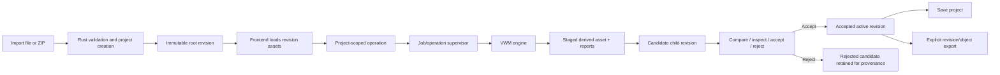

# 3DMk Authoritative VWM Revision Workflow Implementation Plan

> **For agentic workers:** REQUIRED SUB-SKILL: Use `superpowers:subagent-driven-development` (recommended) or `superpowers:executing-plans` to implement this plan task-by-task. Steps use checkbox (`- [ ]`) syntax for tracking.

**Goal:** Make the Rust project/revision model authoritative from import through processing, review, save, reopen, and export, while exposing VWM processing honestly and clearly through the existing 3DMk UI.

**Architecture:** The Axum backend remains the single processing and persistence service for browser and Tauri use. Every loaded scene is a Rust project with an immutable root revision; every geometry-changing operation produces a traceable candidate child revision; every analysis produces a persisted analysis record with exact source membership; the browser owns rendering and review but never authoritative geometry. Explicit export requests select a project revision or derived object, never the incidental contents of the Three.js viewport.

**Tech Stack:** Rust 2021, Axum, Tauri 2, canonical `VWM-Repo-Implicit` crates, Three.js, plain ES modules, filesystem-backed content-addressed assets, UUID identities, SHA-256, Roaring bitmaps for exact source selections, package-local JavaScript tests where required, Windows MSVC.

## Global Constraints

- Windows-first; PowerShell commands and Windows MSVC are the reference development environment.
- No Docker, Podman, Electron, or Python production backend.
- Keep the existing Axum service as the single backend for browser development and Tauri.
- No Tauri-only processing fork.
- No React rewrite in this implementation lane; modularize the existing frontend incrementally into plain ES modules.
- Rust owns import, validation, package I/O, geometry transformation, filtering, reconstruction, sampling, analysis, inference, persistence, revisioning, and export.
- JavaScript owns rendering, user input, view-buffer capture, workflow presentation, and review interaction only.
- Original source bytes and the root measured revision are immutable.
- A failed or cancelled operation publishes no derived revision or partial asset.
- No operation may silently discard normals, colors, UVs, materials, textures, source IDs, calibration, measurements, or provenance.
- A topology-changing operation must emit an explicit attribute-transfer and source-mapping report.
- Automated findings are proposals until accepted by a deterministic rule or the user.
- AI/VLM outputs remain advisory; they may not directly mutate accepted geometry.
- No fake progress percentages. Report a real engine stage and measured progress, or report progress as indeterminate.
- Existing working viewer, camera, package import, measurement, and raw interchange export behavior must remain available during migration.
- This plan refines the authoritative-project, processing, UI/UX, and export lanes of `docs/3dmk-vwm-feature-merge-plan.md`; it does not supersede unrelated long-term platform work.

---

## 1. Current-State Correction

The repository already contains useful foundations:

- `src/projects.rs` defines projects, immutable assets, revisions, operations, analyses, jobs, content-addressed storage, child revisions, active-revision switching, and Rust-owned package export.
- `src/api.rs` exposes project/package/revision read APIs and legacy processing routes.
- `VWM-Repo-Implicit` contains the canonical VWM I/O, geometry, implicit reconstruction, and perception crates.
- `public/index.html` provides a capable Three.js viewer and workflow UI.

The product is still split between two state models:

1. Rust project/revision state created during project or package import.
2. Transient browser state in `loadedGeometryStore`, `currentModelPackage`, undo stacks, overlays, measurements, and browser-built ZIP packages.

The split creates the critical failure: a user can import a Rust project, process it in the browser, click **Save working package**, and receive the previously committed Rust state rather than the visible processed state.

This plan closes that gap before adding more processing algorithms.

## 2. Non-Negotiable Product Invariants

### 2.1 Authoritative state

- Every editable scene has `project_id`, `active_revision_id`, and `generation` before processing controls are enabled.
- `loadedGeometryStore` is a render cache for one revision, not an authoritative document.
- `currentModelPackage` becomes presentation/cache metadata only and cannot decide what project export contains.
- The UI always displays whether the viewport shows an accepted revision, a candidate revision, a comparison, or a transient helper overlay.

### 2.2 Operation lifecycle

Every geometry-changing operation follows:

```text
accepted parent revision
        |
operation record + job
        |
staged derived assets
        |
candidate child revision
        |
quality and attribute-transfer report
        |
user compare / accept / reject
        |
accepted active revision or rejected candidate
```

Structure analysis and recognition may produce analysis/object records without changing geometry. Cleanup, leveling, smoothing, reconstruction, sampling, and accepted object extraction produce candidate revisions.

### 2.3 Exact evidence

- Component cleanup uses exact point, vertex, face, or instance IDs, never bounding-box subtraction.
- Source memberships are persisted as compact binary selection assets.
- Same-topology operations preserve source IDs exactly.
- Resampling and reconstruction emit source mappings and coverage metrics.
- Every detected object can identify its source geometry and contributing observations.

### 2.4 Export truth

- **Save project** exports the authoritative project and all committed/candidate records according to package policy.
- **Export geometry** requires an explicit target revision or object and explicit output format.
- View helpers, measurements, clipping planes, analysis overlays, structural guides, and selection markers are excluded unless explicitly requested as review assets.
- `currentGroup` traversal is never used as the source of authoritative project or geometry export.

## 3. Target Runtime Flow



## 4. Authoritative Contract Additions

### 4.1 Project generation and optimistic concurrency

Every mutating request carries `expected_project_generation`. A stale browser action returns HTTP `409` with the current generation and active revision. This prevents two tabs, stale jobs, or delayed UI actions from silently overwriting project state.

### 4.2 Source selections

Create a versioned selection asset contract:

```rust
pub enum SourceDomain {
    Point,
    Vertex,
    Face,
    Primitive,
    Instance,
}

pub struct SourceSelectionDescriptor {
    pub schema_version: u32,
    pub input_revision_id: Uuid,
    pub domain: SourceDomain,
    pub selected_count: u64,
    pub total_count: u64,
    pub encoding: SelectionEncoding,
    pub sha256: String,
}

pub enum SelectionEncoding {
    RoaringBitmapV1,
}
```

The payload is a Roaring bitmap asset. Metadata stays JSON; memberships stay compact binary.

### 4.3 Candidate revision response

```rust
pub struct CandidateRevisionResponse {
    pub project: Project,
    pub operation: OperationRecord,
    pub job: Option<JobRecord>,
    pub candidate_revision: Revision,
    pub render_asset: Asset,
    pub analysis_records: Vec<AnalysisRecord>,
    pub quality_report: Option<Asset>,
    pub attribute_transfer_report: AttributeTransferReport,
    pub source_mapping_asset: Option<Asset>,
}
```

### 4.4 Attribute transfer report

```rust
pub struct AttributeTransferReport {
    pub input_revision_id: Uuid,
    pub output_revision_id: Uuid,
    pub topology_relation: TopologyRelation,
    pub normals: TransferStatus,
    pub colors: TransferStatus,
    pub uvs: TransferStatus,
    pub material_ids: TransferStatus,
    pub textures: TransferStatus,
    pub source_ids: TransferStatus,
    pub camera_calibration: TransferStatus,
    pub measurements: TransferStatus,
    pub warnings: Vec<ProjectWarning>,
}

pub enum TransferStatus {
    Preserved,
    Recomputed,
    TransferredWithLoss,
    NotApplicable,
    Invalidated,
}
```

### 4.5 Explicit export contract

```rust
pub enum ExportTarget {
    ProjectPackage,
    OriginalRevision,
    ActiveRevision,
    Revision { revision_id: Uuid },
    SelectedObject { object_id: Uuid },
    StructuralLayer { analysis_id: Uuid },
    ResidualObjects { analysis_id: Uuid },
    ComparisonPackage { parent_revision_id: Uuid, candidate_revision_id: Uuid },
}

pub enum ExportFormat {
    ThreeDmkZip,
    Glb,
    Ply,
    Obj,
    Stl,
}
```

## 5. File and Module Map

### Existing files to modify

- `Cargo.toml` — add only dependencies justified by concrete contracts, including `roaring`.
- `src/lib.rs` — register operation, source-map, export, and embedded-static modules.
- `src/projects.rs` — atomic operation/analysis publishing, revision status transitions, project generation checks, object records, measurement records.
- `src/jobs.rs` — bind jobs to operations and publish final IDs only after atomic completion.
- `src/api.rs` — retain router assembly and legacy routes during migration; delegate new `/api/v1` handlers to focused modules.
- `src/point_cloud.rs` — expose reusable engine functions over canonical scenes rather than file-only ASCII PLY boundaries.
- `src/perception.rs` — accept canonical scene/projection evidence and optional configured VLM hook.
- `src/packages.rs` — include operations, analyses, objects, measurements, reports, and exact source selections in project packages.
- `src-tauri/src/main.rs` — materialize or serve the complete vendored frontend tree, not only `index.html`.
- `src-tauri/Cargo.toml` — add the chosen embedded-directory dependency if required.
- `public/index.html` — reduce to markup, module imports, and bootstrap during incremental extraction.
- `tests/frontend_shell.rs` — replace broad string-presence assertions with narrower contract checks.

### New Rust modules

- `src/api_v1/mod.rs`
- `src/api_v1/projects.rs`
- `src/api_v1/revisions.rs`
- `src/api_v1/operations.rs`
- `src/api_v1/exports.rs`
- `src/operations/mod.rs`
- `src/operations/contracts.rs`
- `src/operations/service.rs`
- `src/operations/structure.rs`
- `src/operations/cleanup.rs`
- `src/operations/transform.rs`
- `src/operations/sampling.rs`
- `src/operations/reconstruction.rs`
- `src/operations/perception.rs`
- `src/source_map.rs`
- `src/export_service.rs`
- `src/static_assets.rs`

### New frontend modules

- `public/js/api-client.js`
- `public/js/project-session.js`
- `public/js/revision-loader.js`
- `public/js/operation-client.js`
- `public/js/revision-review.js`
- `public/js/viewport-adapter.js`
- `public/js/export-service.js`
- `public/js/perception-workflow.js`
- `public/js/measurements.js`
- `public/css/app.css`

### New integration tests

- `tests/project_operation_persistence.rs`
- `tests/project_revision_api.rs`
- `tests/processing_revisions.rs`
- `tests/exact_cleanup.rs`
- `tests/export_roundtrip.rs`
- `tests/perception_projection.rs`
- `tests/capability_truth.rs`
- `tests/frontend_contracts.rs`

---

### Task 1: Lock the Baseline and Add Failure-Reproducing Tests

**Files:**
- Create: `docs/status/authoritative-revision-baseline.md`
- Create: `tests/export_roundtrip.rs`
- Create: `tests/frontend_contracts.rs`
- Modify: `tests/frontend_shell.rs`

**Interfaces:**
- Consumes: current project import/export API and current frontend save behavior.
- Produces: failing tests that prove processed browser state is not committed and that viewport helpers can contaminate export.

- [ ] **Step 1: Record current repository and capability baseline**

Document exact commands, current main commit, existing project routes, legacy processing routes, current capability statuses, and known save/export mismatch in `docs/status/authoritative-revision-baseline.md`.

- [ ] **Step 2: Write a failing Rust package round-trip test**

Create a project, import a root scene, create a derived asset and candidate child revision through the current public store API, export the project, re-import/inspect the package, and assert the child revision and derived asset are present. The test must initially expose any package omissions.

- [ ] **Step 3: Write a failing frontend contract test**

Assert that project save cannot branch on `rustProjectId` while browser-only changes exist, and assert that authoritative export does not serialize `currentGroup`.

- [ ] **Step 4: Run the focused tests and capture expected failures**

```powershell
cargo test --test export_roundtrip -- --nocapture
cargo test --test frontend_contracts -- --nocapture
```

Expected: failures demonstrate the current persistence/export mismatch rather than syntax or fixture errors.

- [ ] **Step 5: Commit the baseline tests**

```powershell
git add docs/status/authoritative-revision-baseline.md tests/export_roundtrip.rs tests/frontend_contracts.rs tests/frontend_shell.rs
git commit -m "test: capture authoritative revision gaps"
```

---

### Task 2: Add Atomic Operation, Analysis, and Revision Publishing

**Files:**
- Create: `src/operations/contracts.rs`
- Create: `src/operations/service.rs`
- Create: `src/operations/mod.rs`
- Modify: `src/projects.rs`
- Modify: `src/lib.rs`
- Test: `tests/project_operation_persistence.rs`

**Interfaces:**
- Consumes: `ProjectStore`, `Asset`, `Revision`, `OperationRecord`, `AnalysisRecord`.
- Produces: `OperationService::begin`, `OperationService::publish_candidate`, `ProjectStore::accept_revision`, `ProjectStore::reject_revision`.

- [ ] **Step 1: Write failing atomic-publication tests**

Test that a successful operation writes an operation record, derived asset, analysis/report records, candidate child revision, and updated project generation. Test that an injected failure before final rename leaves none of those visible.

- [ ] **Step 2: Add explicit request/result types**

Define `BeginOperationRequest`, `PublishCandidateRequest`, `CandidateRevisionResponse`, `AttributeTransferReport`, and generation-conflict errors in `src/operations/contracts.rs`.

- [ ] **Step 3: Implement staged atomic publication**

Reuse the existing temp-directory, `sync_all`, and rename patterns from project import. Publish assets and metadata together, then update `project.json` last under the project lock.

- [ ] **Step 4: Implement revision status transitions**

`accept_revision` must mark the candidate accepted, optionally mark warnings, set it active, and increment project generation. `reject_revision` must retain provenance but never make the revision active.

- [ ] **Step 5: Verify persistence after reopen**

```powershell
cargo test --test project_operation_persistence -- --nocapture
```

Expected: all atomicity, generation, accept, reject, and reopen tests pass.

- [ ] **Step 6: Commit**

```powershell
git add src/operations src/projects.rs src/lib.rs tests/project_operation_persistence.rs
git commit -m "feat: publish processing revisions atomically"
```

---

### Task 3: Add Revision Read, Review, Accept, and Reject APIs

**Files:**
- Create: `src/api_v1/mod.rs`
- Create: `src/api_v1/revisions.rs`
- Modify: `src/api.rs`
- Test: `tests/project_revision_api.rs`

**Interfaces:**
- Consumes: operation/revision service from Task 2.
- Produces:
  - `GET /api/v1/projects/:project_id/revisions/:revision_id`
  - `GET /api/v1/projects/:project_id/revisions/:revision_id/assets`
  - `POST /api/v1/projects/:project_id/revisions/:revision_id/accept`
  - `POST /api/v1/projects/:project_id/revisions/:revision_id/reject`

- [ ] **Step 1: Write failing API tests**

Cover valid reads, invalid UUIDs, missing revisions, stale generation conflicts, accept, reject, and active-revision changes.

- [ ] **Step 2: Implement versioned handlers**

Handlers parse IDs, validate expected generation, call only public project/operation services, and return structured errors with `code`, `message`, `retryable`, `current_generation`, and `active_revision_id` where applicable.

- [ ] **Step 3: Register routes without removing legacy routes**

Keep the migration reversible. New UI code uses only `/api/v1`; old routes remain deprecated until Task 15.

- [ ] **Step 4: Run tests**

```powershell
cargo test --test project_revision_api -- --nocapture
```

- [ ] **Step 5: Commit**

```powershell
git add src/api_v1 src/api.rs tests/project_revision_api.rs
git commit -m "feat: expose revision review API"
```

---

### Task 4: Make Every Import Create and Load a Rust Project Session

**Files:**
- Create: `public/js/api-client.js`
- Create: `public/js/project-session.js`
- Create: `public/js/revision-loader.js`
- Modify: `public/index.html`
- Modify: `src/api_v1/projects.rs`
- Modify: `src/api.rs`
- Test: `tests/frontend_contracts.rs`

**Interfaces:**
- Consumes: existing single-file and ZIP project import routes; revision read API.
- Produces: one `ProjectSession` with `projectId`, `generation`, `rootRevisionId`, `activeRevisionId`, `displayedRevisionId`, `candidateRevisionId`, and `displayMode`.

- [ ] **Step 1: Add failing frontend tests**

Assert that every supported direct import calls `/api/v1/projects/import`, ZIP import calls `/api/v1/projects/import-package`, and processing controls remain disabled until a project/revision session exists.

- [ ] **Step 2: Implement `ProjectSession`**

```javascript
export class ProjectSession {
  projectId = null;
  generation = null;
  rootRevisionId = null;
  activeRevisionId = null;
  displayedRevisionId = null;
  candidateRevisionId = null;
  displayMode = 'accepted';

  get ready() {
    return Boolean(this.projectId && this.activeRevisionId);
  }
}
```

- [ ] **Step 3: Route ordinary files through Rust import**

Remove the split where ordinary files load directly into Three.js before project creation. The browser uploads once, receives project/revision IDs, fetches the committed asset, and then renders it.

- [ ] **Step 4: Align advertised formats with backend truth**

The file picker and help text are generated from `/api/v1/capabilities`; formats not directly validated by `vwm-io` are not advertised as available.

- [ ] **Step 5: Convert `loadedGeometryStore` to a revision render cache**

Tag every loaded geometry with `projectId`, `revisionId`, `assetId`, and `layerRole`. Clear or reload cache when revision identity changes.

- [ ] **Step 6: Verify frontend contracts**

```powershell
cargo test --test frontend_contracts -- --nocapture
```

- [ ] **Step 7: Commit**

```powershell
git add public/js public/index.html src/api_v1/projects.rs src/api.rs tests/frontend_contracts.rs
git commit -m "feat: make imports project authoritative"
```

---

### Task 5: Introduce Stable Source IDs and Exact Selection Assets

**Files:**
- Create: `src/source_map.rs`
- Modify: `Cargo.toml`
- Modify: `src/projects.rs`
- Modify: `VWM-Repo-Implicit/crates/vwm-core/src/lib.rs`
- Modify: relevant `vwm-io` loaders and writers
- Test: `tests/exact_cleanup.rs`

**Interfaces:**
- Consumes: root revision canonical geometry.
- Produces: stable point/vertex/face IDs, `SourceSelectionDescriptor`, Roaring bitmap payloads, and source-mapping assets.

- [ ] **Step 1: Write failing stable-ID tests**

Verify that root import assigns deterministic index-based IDs when a source format does not provide IDs, same-topology transforms preserve them exactly, and selections survive serialization/reopen.

- [ ] **Step 2: Add source-ID channels to canonical scenes**

Use typed optional arrays rather than browser metadata. Validate lengths against point, vertex, and face counts.

- [ ] **Step 3: Implement bitmap selection assets**

Add `roaring` and write/read helpers with versioned headers, input revision ID, domain, counts, and SHA-256 verification.

- [ ] **Step 4: Add mapping report contracts for topology changes**

Support nearest-source point/face mapping initially; preserve the ability to add barycentric mappings later without changing the public envelope.

- [ ] **Step 5: Run tests**

```powershell
cargo test --test exact_cleanup -- --nocapture
cargo test --manifest-path VWM-Repo-Implicit/Cargo.toml --workspace
```

- [ ] **Step 6: Commit**

```powershell
git add Cargo.toml src/source_map.rs src/projects.rs VWM-Repo-Implicit tests/exact_cleanup.rs
git commit -m "feat: persist exact source geometry selections"
```

---

### Task 6: Persist Structure Analysis as a Project Analysis

**Files:**
- Create: `src/operations/structure.rs`
- Create: `src/api_v1/operations.rs`
- Modify: `src/operations/mod.rs`
- Modify: `src/point_cloud.rs`
- Modify: `src/projects.rs`
- Modify: `src/api.rs`
- Test: `tests/processing_revisions.rs`

**Interfaces:**
- Consumes: project ID, accepted input revision ID, expected generation, analysis parameters.
- Produces: persisted `AnalysisRecord`, exact component/plane selection assets, overlay/report assets, and no geometry revision.

- [ ] **Step 1: Write a failing project-scoped analysis test**

Import a fixture, submit structure analysis, reopen the project, and assert the analysis, exact selections, plane evidence, algorithm version, parameters, and overlay/report assets remain available.

- [ ] **Step 2: Refactor file-only analysis into canonical-scene functions**

Keep legacy wrappers temporarily, but the authoritative operation loads the stored revision asset through `vwm-io` and never generates an intermediate XYZ-only ASCII PLY.

- [ ] **Step 3: Publish exact cluster and plane memberships**

Persist point/face selections for Keep, Remove, Uncertain, structural planes, and support-plane candidates.

- [ ] **Step 4: Add project-scoped route**

```text
POST /api/v1/projects/{project}/revisions/{revision}/operations/analyze-structure
```

Return operation/job IDs immediately for queued work. On completion, job diagnostics contain the analysis ID and report asset IDs.

- [ ] **Step 5: Verify**

```powershell
cargo test --test processing_revisions structure_analysis -- --nocapture
```

- [ ] **Step 6: Commit**

```powershell
git add src/operations/structure.rs src/api_v1/operations.rs src/point_cloud.rs src/projects.rs src/api.rs tests/processing_revisions.rs
git commit -m "feat: persist VWM structure analysis"
```

---

### Task 7: Implement Exact Cleanup Candidate Revisions

**Files:**
- Create: `src/operations/cleanup.rs`
- Modify: `src/operations/mod.rs`
- Modify: `src/api_v1/operations.rs`
- Modify: `public/js/operation-client.js`
- Modify: `public/js/revision-review.js`
- Modify: `public/index.html`
- Test: `tests/exact_cleanup.rs`

**Interfaces:**
- Consumes: accepted parent revision and one or more persisted selection asset IDs.
- Produces: topology `Subselection` candidate revision, derived scene asset, source mapping, attribute-transfer report, and cleanup metrics.

- [ ] **Step 1: Write failing cleanup tests**

Create a fixture where valid geometry overlaps an artifact bounding box. Assert exact ID cleanup removes only selected primitives and preserves all unselected geometry and applicable attributes.

- [ ] **Step 2: Implement canonical subselection**

Mesh cleanup selects complete faces and remaps required vertices while emitting old-to-new mappings. Point-cloud cleanup selects exact points. The operation never uses centroid/bounding-box exclusion.

- [ ] **Step 3: Publish a candidate child revision**

The candidate remains non-active until accepted. The parent remains renderable for comparison.

- [ ] **Step 4: Replace browser deletion**

Remove `subsetGeometryByBounds` from the authoritative cleanup path. The UI sends selection IDs, polls the job, loads the candidate revision, and opens review.

- [ ] **Step 5: Verify**

```powershell
cargo test --test exact_cleanup -- --nocapture
cargo test --test frontend_contracts cleanup -- --nocapture
```

- [ ] **Step 6: Commit**

```powershell
git add src/operations/cleanup.rs src/api_v1/operations.rs public/js public/index.html tests
git commit -m "feat: create exact cleanup candidate revisions"
```

---

### Task 8: Add the Revision Review UX and State Transparency

**Files:**
- Create: `public/js/revision-review.js`
- Modify: `public/index.html`
- Modify: `public/css/app.css`
- Modify: `public/js/project-session.js`
- Test: `tests/frontend_contracts.rs`

**Interfaces:**
- Consumes: parent/candidate revisions, attribute-transfer report, quality report, operation record.
- Produces: compare, accept, reject, and revert interactions.

- [ ] **Step 1: Write failing UI contract tests**

Require visible project name, active revision, displayed revision, candidate state, parent, operation, attribute warnings, and explicit Accept/Reject controls.

- [ ] **Step 2: Add a persistent workspace status bar**

Show:

```text
Project | Active revision | Displayed state | Candidate/accepted | Backend capability | Job state
```

The UI must visibly warn if it is showing a candidate or stale generation.

- [ ] **Step 3: Add a right-side Review drawer**

Use the existing visual language. Provide parent/candidate opacity comparison, parent-only, candidate-only, and difference highlighting where source mappings allow it.

- [ ] **Step 4: Show evidence and transfer reports**

Display removed/retained counts, residuals, quality gates, exact selection summary, and per-attribute transfer status.

- [ ] **Step 5: Wire Accept and Reject**

Acceptance updates the active revision and reloads it. Rejection returns the viewport to the accepted parent while retaining the rejected record in history.

- [ ] **Step 6: Verify responsive layout**

Manually validate 900×600, 1366×768, 1440×900, and 1920×1080 with no hidden primary actions or horizontal overflow.

- [ ] **Step 7: Commit**

```powershell
git add public/index.html public/css/app.css public/js/revision-review.js public/js/project-session.js tests/frontend_contracts.rs
git commit -m "feat: expose revision review workflow"
```

---

### Task 9: Revision-Back Leveling and Smoothing

**Files:**
- Create: `src/operations/transform.rs`
- Modify: `src/api_v1/operations.rs`
- Modify: `src/point_cloud.rs`
- Modify: `public/js/operation-client.js`
- Modify: `public/index.html`
- Test: `tests/processing_revisions.rs`

**Interfaces:**
- Produces:
  - rigid-transform candidate with `TopologyRelation::RigidTransform`;
  - same-topology smoothing candidate with `TopologyRelation::SameTopology`.

- [ ] **Step 1: Write failing preservation tests**

Verify leveling preserves all vertex/face IDs, normals, colors, UVs, materials, texture references, and camera transforms. Verify smoothing preserves topology and all non-position attributes exactly.

- [ ] **Step 2: Implement canonical rigid transform operation**

Transform geometry, normals, object frames, measurements, and calibrated cameras consistently. Record matrix, datum, selected support plane, and residuals.

- [ ] **Step 3: Implement canonical same-topology smoothing**

Return a candidate scene asset with unchanged indexing and explicit displacement metrics.

- [ ] **Step 4: Migrate UI controls to project-scoped operations**

The frontend no longer uploads ASCII PLY or copies returned positions/matrices into browser geometry.

- [ ] **Step 5: Verify**

```powershell
cargo test --test processing_revisions level -- --nocapture
cargo test --test processing_revisions smooth -- --nocapture
```

- [ ] **Step 6: Commit**

```powershell
git add src/operations/transform.rs src/api_v1/operations.rs src/point_cloud.rs public/js public/index.html tests/processing_revisions.rs
git commit -m "feat: revision-back level and smooth operations"
```

---

### Task 10: Revision-Back Mesh/Point Conversion

**Files:**
- Create: `src/operations/sampling.rs`
- Modify: `src/api_v1/operations.rs`
- Modify: VWM geometry/I/O code only where required by concrete contracts
- Modify: `public/js/operation-client.js`
- Modify: `public/index.html`
- Test: `tests/processing_revisions.rs`

**Interfaces:**
- Produces:
  - area-weighted mesh-to-point candidate with `TopologyRelation::Resampled`;
  - explicit source-face and barycentric/nearest mapping metadata;
  - no browser-only `MeshSurfaceSampler` production path.

- [ ] **Step 1: Write failing deterministic sampling tests**

Use a fixed seed. Verify target count, area proportionality, repeatability, source-face IDs, normals, and color/UV sampling.

- [ ] **Step 2: Implement Rust area-weighted sampling**

Sample indexed and non-indexed meshes without flattening material/attribute contracts.

- [ ] **Step 3: Migrate the UI**

The sample count remains user-configurable, but execution is project-scoped and candidate revision-backed.

- [ ] **Step 4: Verify**

```powershell
cargo test --test processing_revisions mesh_to_points -- --nocapture
```

- [ ] **Step 5: Commit**

```powershell
git add src/operations/sampling.rs src/api_v1/operations.rs VWM-Repo-Implicit public/js public/index.html tests/processing_revisions.rs
git commit -m "feat: revision-back mesh point sampling"
```

---

### Task 11: Revision-Back Reconstruction with Real Quality Gates

**Files:**
- Create: `src/operations/reconstruction.rs`
- Modify: `src/jobs.rs`
- Modify: `src/api_v1/operations.rs`
- Modify: `src/point_cloud.rs`
- Modify: `public/js/operation-client.js`
- Modify: `public/js/revision-review.js`
- Test: `tests/processing_revisions.rs`

**Interfaces:**
- Consumes: accepted point-cloud revision, reconstruction preset, deterministic seed, cancellation token.
- Produces: reconstructed mesh candidate, source mapping, reconstruction-quality analysis/report, real job stages.

- [ ] **Step 1: Write failing reconstruction publication tests**

Assert that cancellation publishes no revision, low-quality output remains review-required with failed gates, and acceptable output publishes one candidate with complete metrics.

- [ ] **Step 2: Isolate the Rust reconstruction worker**

Run Screened Poisson through the canonical VWM path. Keep PDAL as an explicitly separate experimental backend when installed; never present route existence as capability.

- [ ] **Step 3: Implement quality gates**

At minimum record:

- component count;
- source coverage;
- point-to-surface residual percentiles;
- normal agreement;
- triangle degeneracy;
- manifold/boundary indicators;
- bounding-box drift;
- attribute transfer status.

- [ ] **Step 4: Replace fake progress**

Expose real stages such as `prepare`, `orient_normals`, `solve_field`, `extract_surface`, `evaluate_quality`, `publish_candidate`. Use `progress: null` when the engine cannot measure completion.

- [ ] **Step 5: Verify with real fixtures**

Use the versioned point-cloud and known-bad reconstruction fixtures described in `tests/fixtures/manifest.json`.

- [ ] **Step 6: Commit**

```powershell
git add src/operations/reconstruction.rs src/jobs.rs src/api_v1/operations.rs src/point_cloud.rs public/js tests/processing_revisions.rs
git commit -m "feat: publish reviewed reconstruction revisions"
```

---

### Task 12: Build Explicit Rust-Owned Export Products

**Files:**
- Create: `src/export_service.rs`
- Create: `src/api_v1/exports.rs`
- Create: `public/js/export-service.js`
- Modify: `src/packages.rs`
- Modify: `src/api.rs`
- Modify: `public/index.html`
- Test: `tests/export_roundtrip.rs`

**Interfaces:**
- Consumes: `ExportTarget`, `ExportFormat`, project/revision/object/analysis IDs.
- Produces: immutable export asset or streamed download with manifest and transfer report.

- [ ] **Step 1: Write failing target-selection tests**

Verify active, original, specific revision, selected object, structural layer, residual objects, and comparison package resolve to different explicit asset sets.

- [ ] **Step 2: Implement project package export**

Include:

```text
project metadata
source and derived assets
revisions
operations
analyses
objects
measurements
selection/source-mapping assets
quality and attribute-transfer reports
camera/calibration assets
provenance
```

- [ ] **Step 3: Implement interchange export from authoritative scenes**

GLB is the preferred rich interchange output. PLY supports mesh or point attributes where representable. OBJ/STL return explicit warnings for attributes they cannot preserve.

- [ ] **Step 4: Build explicit UI target selection**

The UI first selects *what* to export, then the format. Replace ambiguous labels with:

- Save project;
- Export active revision;
- Export original measured scene;
- Export selected object;
- Export structural surfaces;
- Export residual objects;
- Export comparison package.

- [ ] **Step 5: Remove authoritative use of browser ZIP/model exporters**

Browser PDF/snapshot exports may remain. Project and geometry exports call Rust.

- [ ] **Step 6: Verify round trips**

```powershell
cargo test --test export_roundtrip -- --nocapture
```

The gate is: process fixture → accept revision → save project → reopen/re-import → same active revision identity, geometry counts, attribute contract, analysis IDs, operation IDs, and asset digests.

- [ ] **Step 7: Commit**

```powershell
git add src/export_service.rs src/api_v1/exports.rs src/packages.rs src/api.rs public/js/export-service.js public/index.html tests/export_roundtrip.rs
git commit -m "feat: export authoritative revisions and objects"
```

---

### Task 13: Persist Measurements and Remove Incomplete Browser Undo Claims

**Files:**
- Create: `public/js/measurements.js`
- Modify: `src/projects.rs`
- Modify: `src/api_v1/projects.rs`
- Modify: `public/index.html`
- Test: `tests/project_revision_api.rs`
- Test: `tests/frontend_contracts.rs`

**Interfaces:**
- Produces: revision-aware measurement sets anchored to source primitive IDs plus local/barycentric coordinates.

- [ ] **Step 1: Write failing measurement persistence tests**

Verify measurements survive save/reopen and are either transferred or explicitly invalidated when the active revision changes.

- [ ] **Step 2: Persist measurement sets through Rust**

World coordinates alone are insufficient. Store revision ID, primitive/source ID, local anchor, display units, and provenance.

- [ ] **Step 3: Rename browser undo/redo semantics**

Until all state is transaction-backed, browser history is limited to viewport edit previews. Accepted revisions are reverted through revision selection, not the five-entry geometry stack.

- [ ] **Step 4: Commit**

```powershell
git add public/js/measurements.js src/projects.rs src/api_v1/projects.rs public/index.html tests
git commit -m "feat: persist revision-aware measurements"
```

---

### Task 14: Wire Real Perception, Object Records, and VLM Adjudication

**Files:**
- Create: `src/operations/perception.rs`
- Create: `public/js/perception-workflow.js`
- Modify: `src/perception.rs`
- Modify: `src/projects.rs`
- Modify: `src/api_v1/operations.rs`
- Modify: `public/index.html`
- Test: `tests/perception_projection.rs`

**Interfaces:**
- Consumes: RGBA, depth, primitive-ID buffer, camera projection/view matrices, revision ID, packaged model manifest.
- Produces: persisted object records, exact geometry memberships, evidence views, classifier candidates, optional VLM adjudication, and no geometry mutation.

- [ ] **Step 1: Write failing projection tests**

Use a synthetic ID buffer and camera contract. Verify a 2D mask maps to the exact source faces/points and persists as an object selection asset.

- [ ] **Step 2: Implement renderer evidence capture**

Capture controlled views with RGBA, depth, primitive IDs, camera transform, and projection matrix. Never submit an ungrounded screenshot as 3D evidence.

- [ ] **Step 3: Package and validate an ONNX model manifest**

If no distributable model is available, capability remains `unavailable`; deterministic color segmentation remains test-only and is never labelled recognition.

- [ ] **Step 4: Implement multiview fusion and object records**

Object records include local frame, oriented bounds, exact source selection, candidate labels, confidence, evidence IDs, model/version provenance, and review decision.

- [ ] **Step 5: Add optional VLM hook**

Invoke only below configured confidence or on explicit request. The VLM receives cropped evidence plus deterministic geometry facts and returns typed label/adjudication proposals.

- [ ] **Step 6: Expose object review and export**

Objects appear as durable scene entities, not temporary cards. The user can isolate, rename, accept/reject labels, and export exact object geometry.

- [ ] **Step 7: Verify**

```powershell
cargo test --test perception_projection -- --nocapture
```

- [ ] **Step 8: Commit**

```powershell
git add src/operations/perception.rs src/perception.rs src/projects.rs src/api_v1/operations.rs public/js/perception-workflow.js public/index.html tests/perception_projection.rs
git commit -m "feat: persist grounded perception objects"
```

---

### Task 15: Modularize the Frontend and Retire Legacy Processing Paths

**Files:**
- Create/complete: `public/js/*.js`
- Create/complete: `public/css/app.css`
- Modify: `public/index.html`
- Modify: `src/api.rs`
- Test: `tests/capability_truth.rs`
- Test: `tests/frontend_contracts.rs`

**Interfaces:**
- Consumes: all completed `/api/v1` workflows.
- Produces: no production calls to legacy processing routes and one authoritative frontend state store.

- [ ] **Step 1: Move global state and API code into focused modules**

Keep rendering-specific objects in `viewport-adapter.js`; project/revision identity in `project-session.js`; processing in `operation-client.js`; review in `revision-review.js`; export in `export-service.js`.

- [ ] **Step 2: Remove legacy production calls**

The frontend must not call:

```text
/api/point-cloud-analyze
/api/flat-surface-correct
/api/mesh-smooth
/api/point-cloud-to-mesh
/api/model-floorplan-recognize
/api/vwm-perception
```

until equivalent project-scoped routes exist; then remove the calls entirely.

- [ ] **Step 3: Keep legacy routes behind an explicit compatibility flag**

Default release configuration disables them. Development may temporarily enable them for comparison until this task is complete.

- [ ] **Step 4: Make capability status visible**

Controls show `available`, `degraded`, `experimental`, or `unavailable` with the backend-provided reason. Route existence alone cannot enable a feature.

- [ ] **Step 5: Verify**

```powershell
cargo test --test capability_truth -- --nocapture
cargo test --test frontend_contracts -- --nocapture
```

- [ ] **Step 6: Commit**

```powershell
git add public src/api.rs tests/capability_truth.rs tests/frontend_contracts.rs
git commit -m "refactor: retire browser-owned processing paths"
```

---

### Task 16: Vendor Frontend Assets and Harden Tauri Delivery

**Files:**
- Create: `src/static_assets.rs`
- Create: `public/vendor/` assets required by Three.js, exporters, JSZip, jsPDF, Draco, and BVH
- Modify: `src-tauri/src/main.rs`
- Modify: `src-tauri/Cargo.toml`
- Modify: `src-tauri/tauri.conf.json`
- Modify: `public/index.html`
- Test: `tests/frontend_contracts.rs`

**Interfaces:**
- Produces: complete offline frontend tree served by the embedded Axum backend in Tauri release.

- [ ] **Step 1: Write failing offline asset tests**

Assert that `public/index.html` contains no external CDN or Google-hosted runtime URLs and every referenced module exists in the embedded public tree.

- [ ] **Step 2: Vendor exact dependency versions**

Record licenses and hashes. Do not download dependencies dynamically at runtime.

- [ ] **Step 3: Embed/materialize the complete public tree**

Replace the current single `include_str!("../../public/index.html")` behavior with a recursive embedded directory or equivalent deterministic materialization.

- [ ] **Step 4: Enable Tauri bundling and CSP**

Permit only the loopback service and required local schemes. Verify clean-machine launch without internet access.

- [ ] **Step 5: Build and launch**

```powershell
cargo test
Push-Location src-tauri
cargo tauri build --no-bundle
Pop-Location
```

- [ ] **Step 6: Commit**

```powershell
git add src/static_assets.rs public/vendor public/index.html src-tauri tests/frontend_contracts.rs
git commit -m "feat: make Tauri frontend self contained"
```

---

### Task 17: End-to-End Acceptance and Migration Closure

**Files:**
- Create: `docs/status/authoritative-revision-completion.md`
- Create: `docs/validation/authoritative-revision-test-report.md`
- Modify: `docs/3dmk-vwm-feature-merge-plan.md` status section only
- Modify: capability and migration documentation as required

**Interfaces:**
- Produces: evidence that the browser/Rust split is closed.

- [ ] **Step 1: Run the complete automated suite**

```powershell
cargo fmt --check
cargo clippy --all-targets --all-features -- -D warnings
cargo test
cargo test --manifest-path VWM-Repo-Implicit/Cargo.toml --workspace
Push-Location src-tauri
cargo test
cargo tauri build --no-bundle
Pop-Location
```

- [ ] **Step 2: Run the real vertical slice**

Using a versioned real scan fixture:

```text
import
→ project/root revision created
→ structure analysis persisted
→ exact cleanup candidate created
→ parent/candidate comparison shown
→ candidate accepted
→ application closed
→ application reopened
→ accepted cleaned revision loaded
→ project saved
→ project re-imported
→ accepted cleaned revision and history preserved
→ cleaned GLB and PLY exported explicitly
```

- [ ] **Step 3: Verify export exclusions**

Confirm project and geometry exports contain no viewport grid, measurement markers, clipping helpers, analysis boxes, or room-plan lines unless explicitly requested as review/report assets.

- [ ] **Step 4: Verify failure behavior**

Cancel reconstruction and perception jobs, inject a storage failure, and confirm no partial revision becomes visible.

- [ ] **Step 5: Verify UI state truth**

At all times the UI must reveal project, active revision, displayed revision, candidate status, operation/job state, capability status, and whether the shown result is accepted.

- [ ] **Step 6: Write the validation report**

Record exact commands, versions, fixtures, timings, VRAM/RAM observations, failures, screenshots, exported package hashes, and remaining limitations.

- [ ] **Step 7: Commit**

```powershell
git add docs src public tests
git commit -m "docs: validate authoritative revision workflow"
```

---

## 6. Required First Execution Batch

The first implementation session must complete Tasks 1–4 only. It must not start new geometry algorithms, perception models, CUDA work, or UI redesign beyond the project-session/status requirements.

The first batch is accepted only when:

1. ordinary model import creates a Rust project and root revision;
2. the frontend loads geometry from that committed revision;
3. the UI visibly displays project and active revision identity;
4. processing controls are disabled without a valid revision session;
5. revision read/accept/reject APIs are tested;
6. the current save/export mismatch has a failing regression test ready for the later export task.

## 7. Migration and Rollback

- Legacy APIs remain present with deprecation headers while their `/api/v1` replacements are being integrated.
- A runtime feature flag allows reverting the frontend to the legacy workflow during development only.
- Every task is independently revertible and must preserve project schema compatibility unless the task explicitly increments the schema version and includes migration tests.
- Old browser-generated `3dmk-package-v1` ZIPs remain importable through the Rust package parser; import converts them into a new authoritative project rather than reviving browser-owned state.
- Existing root projects remain readable. Schema upgrades are copy-on-write and preserve the original package/source assets.
- Do not delete old routes, JSZIP package code, or legacy output fixtures until Task 15 tests prove zero production callers and Task 17 proves round-trip parity.

## 8. Definition of Done

This plan is complete only when all statements below are true:

- Every loaded scene is backed by a Rust project and revision.
- The source asset and root revision remain immutable.
- Every geometry mutation creates a candidate child revision with operation provenance.
- Structure analysis and perception are persisted, reloadable, and source-grounded.
- Cleanup uses exact source IDs and never bounding-box deletion.
- Leveling and smoothing preserve their declared attribute contracts.
- Mesh/point conversion and reconstruction publish source mappings and quality reports.
- Candidate revisions are visibly compared, accepted, or rejected.
- Closing and reopening the application restores the accepted active revision.
- **Save project** includes the processed accepted state visible in the application.
- Explicit export targets exist for source, active revision, selected revision, object, structural layer, residual objects, and comparison package.
- Project/geometry export never traverses the incidental Three.js viewport group.
- View helpers and review overlays are excluded by default.
- No production frontend processing calls use deprecated file-upload routes.
- Capability labels match actual runtime dependencies and validation status.
- The Tauri application works without internet access.
- Full Rust, VWM workspace, frontend-contract, round-trip, and Tauri build gates pass.

## 9. Plan Self-Review

- **Placeholder scan:** no `TBD`, `TODO`, or unspecified implementation task remains.
- **Internal consistency:** every geometry-changing operation terminates in the same candidate-revision review contract; analyses do not masquerade as revisions.
- **Scope check:** this plan deliberately excludes new geometry research, CFD/FEM, Mamba/diffusion, CUDA optimization, BIM expansion, and a framework rewrite. Those depend on the authoritative workflow and follow later.
- **Ambiguity check:** “save,” “export,” “candidate,” “accepted,” “object,” “analysis,” and “overlay” have explicit, non-overlapping meanings.
- **Primary risk:** implementing later processing tasks before Tasks 1–8 would recreate the browser/Rust split. The dependency order is mandatory.
