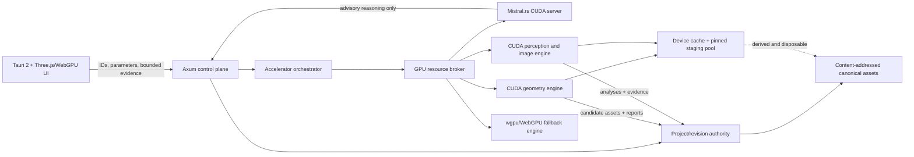

# 3DMk CUDA-First System Architecture Design

**Status:** Governing architecture amendment  
**Decision date:** 2026-08-07  
**Scope:** Complete 3DMk system, including the Tauri application, Axum service, VWM engines, local Mistral.rs server, perception, geometry processing, persistence, export, and deployment validation  
**Supersedes:** Any statement that CUDA is optional only for the local coding executor or that a CPU-only installation is a complete 3DMk system

## 1. Executive decision

The complete 3DMk system requires an NVIDIA CUDA-capable GPU. CUDA is the primary compute substrate for every workload where parallel execution, accelerator-resident data, or GPU inference provides material value.

This does **not** mean forcing inherently serial control-plane work onto the GPU. Project metadata, ZIP validation, filesystem transactions, API routing, audit logging, and other low-arithmetic-intensity work remain CPU-owned. It means the system is designed around the fact that a CUDA device is always present and that heavy compute paths shall use it by default.

The selected architecture is:

```text
mandatory CUDA system baseline
+ CUDA-first compute plane
+ CPU control and I/O plane
+ WebGPU/Vulkan fallback for eligible non-LLM operations
+ CPU reference paths for validation and diagnostics only
```

A CPU-only installation may launch a hardware-diagnostics surface, but it is not a compliant or operational 3DMk installation.

## 2. Alternatives considered

### 2.1 Selected: heterogeneous CUDA-primary architecture

CUDA owns heavy geometry, point-cloud, image, vision, inference, and future simulation workloads. Rust retains authoritative scheduling, persistence, provenance, and deterministic contracts. WebGPU/Vulkan remains available for individual kernels where a CUDA implementation is absent or where rendering integration makes the generic graphics path preferable.

**Why selected:** It obtains the practical benefit of the mandatory NVIDIA GPU without misplacing control-plane work, preserves deterministic Rust authority, and allows staged migration rather than a destabilizing rewrite.

### 2.2 Rejected: CUDA-only monolith

Every operation, including parsing, package validation, orchestration, and persistence, would be forced through CUDA-oriented code.

**Why rejected:** It increases complexity and copies without improving low-intensity workloads. It would also couple durable product contracts to device-specific memory and execution details.

### 2.3 Rejected: generic GPU abstraction first

All compute would initially target WebGPU/wgpu, with CUDA added later as one backend.

**Why rejected:** It optimizes for portability that the complete system no longer requires, prevents use of mature CUDA-specific libraries and execution features, and risks permanently constraining kernels to the lowest common denominator.

## 3. Non-negotiable system invariants

1. **CUDA is a minimum system requirement.** A supported NVIDIA GPU, driver, CUDA-enabled Mistral.rs binary, and live CUDA runtime evidence are required.
2. **Mistral.rs never falls back to CPU.** A smaller model, lower quantization footprint, shorter context, or revised device mapping may be selected, but the server must remain CUDA-backed.
3. **Compute-heavy product operations select CUDA first.** A fallback must be explicit, observable, and recorded in operation provenance.
4. **The CPU remains authoritative for control and durable state.** CUDA buffers and caches are derived execution state, not the project document of record.
5. **The browser never becomes a second compute authority.** JavaScript renders, collects interaction and view evidence, and presents review state. Rust owns production transformations and analyses.
6. **Bulk geometry does not cross Tauri IPC.** The frontend exchanges IDs, parameters, summaries, progress, and bounded review assets.
7. **GPU failures publish no partial revision.** Allocation failure, kernel failure, device loss, cancellation, or timeout leaves authoritative project state unchanged.
8. **Backend choice is evidence.** Every operation records the selected backend, device, kernel or engine version, precision mode, timings, memory high-water mark, fallback reason, and warnings.
9. **WebGPU/Vulkan is not a system-compliance substitute.** It may satisfy an individual non-LLM operation when the contract allows it; it cannot replace the mandatory CUDA-backed Mistral.rs server.
10. **CPU implementations are reference or diagnostic paths.** They support equivalence testing, small deterministic fixtures, and recovery diagnostics; they are not the normal production backend for heavy operations.

## 4. Minimum supported hardware contract

The initial supported minimum is:

| Resource | Minimum contract |
|---|---|
| GPU | NVIDIA CUDA-capable GPU accepted by the runtime hardware validator |
| VRAM | 6 GiB usable device memory |
| System RAM | 32 GiB minimum; 48 GiB reference configuration |
| Driver | NVIDIA driver compatible with the selected CUDA-enabled Mistral.rs and product CUDA build |
| CUDA toolchain | Required for development/source builds; release packaging may provide prebuilt CUDA artifacts when licensing and deployment validation permit |
| Operating system | Windows 11 x64 |
| CPU | x64 CPU capable of running the Rust control plane and CPU reference tests |
| Storage | NVMe-class storage strongly recommended for model, scene, cache, and revision assets |

The reference validation machine is the existing RTX 4050 6 GiB / 48 GiB RAM Windows system. Larger GPUs are supported through the same contracts and shall receive proportionally larger runtime budgets rather than separate code paths.

## 5. System architecture



### 5.1 Control plane

The Rust/Axum control plane owns:

- project, asset, revision, operation, analysis, measurement, and job records;
- immutable concrete API and file contracts;
- job admission, cancellation, fault handling, and publication;
- GPU capability discovery and backend selection;
- cross-process Mistral.rs lifecycle and health;
- deterministic validation and provenance;
- explicit export products.

The control plane must remain usable enough to report a blocking hardware diagnosis even when CUDA initialization fails. Product workflows remain disabled until the CUDA system gate succeeds.

### 5.2 Compute plane

The compute plane contains:

- Mistral.rs CUDA inference;
- custom CUDA geometry and point-cloud kernels;
- CUDA-backed ONNX inference;
- CUDA image projection and multiview fusion;
- GPU-resident intermediate representations;
- wgpu/WebGPU fallback kernels where permitted;
- CPU reference implementations used for equivalence and fault diagnosis.

### 5.3 Rendering plane

CUDA is not a browser rendering API. Three.js rendering may continue through WebGL during the current migration and move to WebGPU where validated. Rendering consumes bounded preview or canonical render assets produced by Rust. It must not cause production geometry to be reconstructed from incidental viewport objects.

## 6. Accelerator inventory and startup gate

The application shall expose one authoritative accelerator inventory.

```rust
pub struct AcceleratorInventory {
    pub schema_version: u32,
    pub system_compliant: bool,
    pub cuda: CudaInventory,
    pub mistralrs: MistralRuntimeEvidence,
    pub generic_gpu: Option<GenericGpuInventory>,
    pub budgets: GpuBudgetSnapshot,
    pub blockers: Vec<AcceleratorBlocker>,
    pub warnings: Vec<AcceleratorWarning>,
}

pub struct CudaInventory {
    pub driver_version: String,
    pub runtime_version: String,
    pub devices: Vec<CudaDeviceRecord>,
    pub selected_device_ordinal: u32,
    pub selected_device_uuid: String,
    pub total_memory_bytes: u64,
    pub free_memory_bytes_at_start: u64,
    pub compute_capability: String,
}

pub struct MistralRuntimeEvidence {
    pub executable_sha256: String,
    pub source_commit: String,
    pub compiled_features: Vec<String>,
    pub process_id: u32,
    pub cuda_process_observed: bool,
    pub model_id: String,
    pub quantization: String,
    pub context_limit: u32,
    pub device_mapping_digest: String,
}
```

Startup is dependency ordered:

```text
1. Inspect NVIDIA driver and CUDA devices.
2. Validate minimum VRAM and selected device identity.
3. Validate the CUDA-enabled Mistral.rs executable and source provenance.
4. Start Mistral.rs with an explicit VRAM/KV budget.
5. Observe the exact Mistral.rs PID as a CUDA compute process.
6. Initialize the product CUDA context and execute a known-answer smoke kernel.
7. Initialize the GPU resource broker and memory pools.
8. Publish the accelerator inventory.
9. Enable project workflows only when system_compliant = true.
```

A failure produces a precise blocker code and diagnostics. It must not silently start CPU inference or mark CUDA merely because a CUDA-capable binary exists.

## 7. GPU resource broker

The RTX 4050 reference system has limited VRAM shared by the LLM server, geometry jobs, perception, image processing, and rendering. Uncoordinated independent allocators will produce nondeterministic out-of-memory failures. A system-wide resource broker is therefore mandatory.

### 7.1 Broker contract

```rust
pub enum GpuWorkloadClass {
    LlmInteractive,
    ViewportInteractive,
    GeometryInteractive,
    VisionInteractive,
    GeometryBatch,
    ReconstructionBatch,
    ExportBatch,
}

pub struct GpuLeaseRequest {
    pub job_id: Uuid,
    pub workload: GpuWorkloadClass,
    pub minimum_bytes: u64,
    pub preferred_bytes: u64,
    pub stream_count: u16,
    pub preemptible: bool,
    pub deadline_ms: Option<u64>,
}

pub struct GpuLease {
    pub lease_id: Uuid,
    pub device_uuid: String,
    pub granted_bytes: u64,
    pub stream_ids: Vec<u32>,
    pub issued_at: String,
    pub expires_at: Option<String>,
}
```

### 7.2 Scheduling rules

- Reserve the greater of 512 MiB or ten percent of total VRAM as safety headroom.
- Bound Mistral.rs KV-cache memory using explicit paged-attention configuration rather than allowing it to consume all free VRAM.
- Use Mistral.rs device mapping and quantization to preserve a CUDA-resident hot path while respecting the product budget.
- Do not admit a batch geometry or reconstruction job whose minimum lease would violate the safety reserve.
- Prefer queueing over optimistic allocation and crash recovery.
- Interactive viewport and cancellation work outrank batch reconstruction.
- A smaller CUDA-backed LLM model may replace a larger model when the approved workload profile cannot coexist within the measured budget.
- Record queue time, lease wait, allocation high-water mark, kernel time, transfer time, and release time.
- Recover leases after process failure and verify device memory returns within a bounded interval.

### 7.3 Process boundary

Mistral.rs is a separate process. The broker therefore uses:

- explicit Mistral.rs configuration for context, paged-attention memory, quantization, and device mapping;
- NVIDIA process telemetry to attribute device memory to the server PID;
- process lifecycle control for restart or model-profile changes;
- conservative admission based on observed free memory rather than assuming exclusive CUDA ownership.

The product must not depend on undocumented internal Mistral.rs memory structures.

## 8. GPU-native data architecture

### 8.1 External versus internal formats

External compatibility formats remain unchanged at system boundaries. They are normalized once into GPU-suitable canonical structures.

```text
OBJ / PLY / GLB / scan ZIP / image assets
        |
validated CPU streaming ingest
        |
canonical typed chunks + stable source IDs
        |
pinned staging buffers
        |
CUDA device buffers and derived indexes
        |
operations and analyses
        |
versioned canonical assets / explicit exports
```

### 8.2 Canonical geometry layout

The canonical Rust representation shall support structure-of-arrays storage and stable IDs:

```rust
pub struct PointChunk {
    pub positions_xyz_f32: Vec<[f32; 3]>,
    pub normals_xyz_f32: Option<Vec<[f32; 3]>>,
    pub colors_rgba_u8: Option<Vec<[u8; 4]>>,
    pub confidence_f32: Option<Vec<f32>>,
    pub source_ids_u64: Vec<u64>,
}
```

Device representations may split fields into independently aligned buffers for coalesced access. The exact device layout is implementation-private but its mapping to stable source IDs is not.

### 8.3 Precision policy

- Project transforms, units, datum, measurements, and quality thresholds remain represented with sufficient precision for the domain, normally `f64` in control metadata.
- Geometry positions may use local-origin `f32` chunks when the quantization error is proven below the declared tolerance.
- CUDA image and inference intermediates may use `f16`, BF16, FP8, or quantized representations only when the operation contract records the precision mode and validation proves acceptable error.
- Export never silently inherits a reduced-precision intermediate when a higher-precision canonical asset exists.

### 8.4 Transfer policy

- Use pinned host staging buffers for large asynchronous transfers.
- Reuse device allocations through bounded memory pools.
- Fuse adjacent kernels where it removes material global-memory traffic without obscuring verification.
- Keep intermediate data device-resident across a pipeline whenever downstream stages use the same representation.
- Chunk datasets larger than the granted lease; do not require whole-scene device residency.
- Avoid repeated decode, parse, coordinate conversion, or AoS/SoA reshaping.
- Emit copy counts and transferred bytes in operation metrics.

## 9. CUDA-first subsystem map

| Subsystem | Primary path | Permitted fallback | Notes |
|---|---|---|---|
| Mistral.rs LLM | CUDA with paged attention and CUDA decode optimizations | None | Smaller model/context/device map is allowed; CPU inference is not |
| Project/package I/O | Rust CPU streaming | None needed | Normalize directly into chunked canonical assets |
| Coordinate transforms | CUDA batched kernels | wgpu for eligible display-only transforms; CPU reference tests | Authoritative transforms still publish Rust revisions |
| Bounds/statistics | CUDA reductions | wgpu or CPU reference for small fixtures | Reuse reductions across later stages |
| Normal estimation | CUDA spatial-neighborhood kernels | wgpu, then CPU reference | Preserve source IDs and confidence |
| Filtering/outlier cleanup | CUDA compaction and classification | wgpu, then CPU reference | Exact selection assets remain authoritative |
| Connected components/clustering | CUDA graph/voxel kernels | CPU reference for equivalence | Results require deterministic canonical ordering |
| Mesh smoothing | CUDA same-topology kernels | wgpu, then CPU reference | Preserve source IDs and attributes |
| Mesh sampling | CUDA area weighting and sampling | wgpu, then CPU reference | Deterministic seed is mandatory |
| Point-cloud preparation | CUDA | wgpu, then CPU reference | Includes voxelization, orientation, confidence, and indexing |
| Implicit reconstruction | CUDA-first staged solver/extraction | Existing Rust CPU implementation during migration | CPU path is temporary and reported as non-primary until CUDA parity gates pass |
| Image projection/fusion | CUDA | wgpu, then CPU reference | Calibration and visibility evidence are preserved |
| ONNX perception | ONNX Runtime CUDA Execution Provider | CPU reference for test fixtures only | TensorRT may be added later behind the same contract |
| VWM reasoning | Deterministic CUDA/CPU evidence generation plus Mistral.rs CUDA interpretation | No CPU LLM | LLM output remains advisory |
| Rendering | Three.js WebGPU/WebGL | Existing renderer during migration | CUDA produces data; browser graphics API renders it |
| Export preparation | CUDA for decimation, normals, LOD, sampling | CPU for serialization and file writing | Explicit export target remains mandatory |

## 10. Rust crate and module boundaries

The implementation plan shall introduce focused boundaries rather than adding CUDA conditionals throughout product code.

```text
crates/
├── vwm-accelerator-contracts   # backend-neutral public contracts
├── vwm-gpu-runtime             # inventory, broker, leases, telemetry
├── vwm-cuda                    # contexts, streams, memory pools, kernel launch
├── vwm-cuda-geometry           # transforms, reductions, normals, filtering, sampling
├── vwm-cuda-implicit           # preparation, field solve, extraction
├── vwm-cuda-vision             # image projection, fusion, CUDA inference adapters
├── vwm-wgpu-fallback           # eligible generic GPU fallbacks
└── vwm-cpu-reference           # deterministic reference implementations
```

Existing public VWM crates consume accelerator contracts and remain free of direct Tauri or product-persistence concerns.

A representative backend interface is:

```rust
pub trait GeometryComputeBackend: Send + Sync {
    fn identity(&self) -> ComputeBackendIdentity;

    fn transform(
        &self,
        lease: &GpuLease,
        input: &CanonicalSceneRef<'_>,
        request: &TransformRequest,
        cancellation: &CancellationToken,
    ) -> Result<TransformResult, ComputeError>;

    fn estimate_normals(
        &self,
        lease: &GpuLease,
        input: &PointCloudRef<'_>,
        request: &NormalEstimationRequest,
        cancellation: &CancellationToken,
    ) -> Result<NormalEstimationResult, ComputeError>;
}
```

The public service selects the backend through policy and capability evidence. Callers do not contain CUDA-specific branching.

## 11. Backend selection policy

```rust
pub enum BackendRequirement {
    CudaRequired,
    CudaPreferred {
        allowed_fallbacks: Vec<ComputeBackendKind>,
    },
    CpuControlPlane,
}

pub struct BackendDecision {
    pub requirement: BackendRequirement,
    pub selected: ComputeBackendIdentity,
    pub reason_code: String,
    pub fallback_used: bool,
    pub fallback_reason: Option<String>,
    pub capability_snapshot_sha256: String,
}
```

Rules:

- LLM inference is always `CudaRequired`.
- Production heavy geometry, reconstruction, perception, and image operations are `CudaPreferred` during staged migration and become `CudaRequired` after their CUDA acceptance gates pass.
- WebGPU/Vulkan may be listed only for operations with an implemented and verified fallback.
- CPU may not be listed as a normal production fallback for heavy operations after CUDA parity is accepted.
- Small metadata, I/O, parsing, and serialization operations are `CpuControlPlane` and are not reported as accelerator failures.
- The UI shows the actual selected backend for every long-running job.

## 12. Race, process, and fault analysis

CUDA adoption introduces process and concurrency hazards that must be designed, not patched after failure.

### 12.1 Required analysis graph

```text
process graph
+ task graph
+ CUDA context/stream graph
+ host/device buffer ownership graph
+ read/write sets
+ event and synchronization edges
+ cancellation graph
+ publication transaction
```

### 12.2 Hazards to detect and test

- a host buffer reused before asynchronous transfer completion;
- a device buffer freed while a stream, event, or CUDA graph still references it;
- two jobs writing the same canonical output or temporary asset;
- stale project generation publishing after a long GPU job;
- cancellation that stops the API job but leaves kernels or workers publishing later;
- Mistral.rs and a product job independently exhausting VRAM;
- lock inversion between project state, job state, and GPU leases;
- device loss or driver reset during a staged operation;
- process termination before pinned memory or temporary assets are released;
- nondeterministic result ordering from parallel compaction or reductions;
- inconsistent precision or tolerance between CUDA and reference implementations.

### 12.3 Synchronization rules

- Prefer ownership transfer and bounded channels over shared mutable global state.
- Use explicit CUDA events for cross-stream dependencies.
- Never hold a project-store lock while waiting for a GPU lease or kernel completion.
- Stage all outputs outside the authoritative project namespace and publish atomically only after GPU completion, validation, and generation checks.
- Cancellation prevents publication even when a non-preemptible kernel finishes later.
- Canonicalize parallel output ordering before hashing or persistence.

## 13. Mistral.rs coexistence policy

Mistral.rs is both mandatory and a major VRAM consumer. It must be planned as part of the product, not treated as an unrelated background process.

- Run Mistral.rs with a measured, explicit maximum sequence length and paged-attention memory budget.
- Use `mistralrs tune` and recorded device mapping as input evidence, not as an unreviewed final configuration.
- Preserve CUDA decode graphs and paged-attention fast paths unless a reproducible defect requires disabling them.
- Keep the selected model, quantization, context, paged-attention budget, and device map in versioned runtime configuration.
- Admit product GPU jobs against observed free memory after Mistral.rs startup.
- For the 6 GiB reference GPU, prefer a model profile that leaves enough memory for interactive geometry and vision work; a larger model that starves the rest of the application is not an optimized system.
- When a batch operation cannot coexist, queue it, reduce its chunk size, or apply an approved model/runtime profile transition. Do not race allocations.
- LLM output remains advisory and cannot directly publish geometry or accepted revisions.

## 14. Capability and UX contract

The capability API shall report backend truth rather than route existence.

```json
{
  "system_compliant": true,
  "accelerator": {
    "primary": "cuda",
    "device": "NVIDIA GeForce RTX 4050 Laptop GPU",
    "total_vram_bytes": 6442450944,
    "mistralrs_cuda_verified": true
  },
  "capabilities": [
    {
      "id": "mesh_smoothing",
      "status": "available",
      "primary_backend": "cuda",
      "active_backend": "cuda",
      "fallbacks": ["wgpu"],
      "reason": "CUDA same-topology smoothing kernel passed parity and performance gates."
    }
  ]
}
```

The UI must display:

- CUDA device and current memory pressure;
- Mistral.rs model and CUDA status;
- queued/running GPU jobs and lease state;
- selected backend for each operation;
- fallback use and reason;
- precise blocker diagnostics when the system is not compliant;
- measured progress or an honest indeterminate state.

## 15. Persistence and provenance

Every CUDA-backed operation extends the existing operation record with accelerator evidence:

```rust
pub struct AcceleratorExecutionRecord {
    pub backend: ComputeBackendIdentity,
    pub device_uuid: String,
    pub driver_version: String,
    pub runtime_version: String,
    pub kernel_bundle_sha256: String,
    pub precision_mode: String,
    pub deterministic_seed: Option<u64>,
    pub lease_id: Uuid,
    pub device_memory_high_water_bytes: u64,
    pub host_to_device_bytes: u64,
    pub device_to_host_bytes: u64,
    pub queue_ms: u64,
    pub transfer_ms: u64,
    pub kernel_ms: u64,
    pub validation_ms: u64,
    pub fallback_reason: Option<String>,
}
```

Device caches are disposable and are not exported as canonical project content. Kernel identities, parameters, precision, mappings, quality reports, and results are durable.

## 16. Verification strategy

### 16.1 Correctness

For every CUDA kernel family:

1. Create a deterministic CPU reference implementation or retained known-good oracle.
2. Run exact or tolerance-based differential tests.
3. Test empty, minimal, degenerate, malformed, and maximum-chunk cases.
4. Verify stable source IDs and canonical output ordering.
5. Verify cancellation and failure publish nothing.
6. Verify serialization/reopen produces the same accepted result identity.

### 16.2 Concurrency and fault testing

- overlapping streams with explicit dependency events;
- simultaneous Mistral.rs inference and bounded geometry jobs;
- lease starvation and priority inversion;
- forced allocation failure;
- forced worker termination;
- stale project generation at publication time;
- device reset simulation where practical;
- repeated cancellation during transfer, kernel, validation, and publication stages;
- long soak tests checking host, pinned, and device memory return to baseline.

### 16.3 Performance gates

Initial acceptance targets on representative fixtures are:

| Workload | Gate |
|---|---|
| Bulk transforms/reductions | At least 5x CPU-reference throughput after transfer amortization on a one-million-element fixture |
| Normals/filtering/sampling | At least 3x end-to-end CPU-reference throughput on the declared representative fixture |
| Heavy multi-stage pipelines | At least 2x end-to-end improvement over the retained CPU baseline |
| Host/device transfer share | No more than 25% of elapsed time for sustained compute pipelines unless the report explains an I/O-bound workload |
| Cancellation | Product job becomes non-publishable immediately; resources return within the operation-specific bounded timeout |
| Coexistence | No CUDA OOM in the defined Mistral.rs plus interactive-geometry acceptance scenario |
| Determinism | Repeated seeded runs produce identical canonical IDs, ordering, hashes, and accepted outputs within declared floating-point tolerance |

A kernel that is faster in isolation but slows the complete workflow through copies, synchronization, or VRAM contention does not pass.

### 16.4 Deployment gate

A release candidate must prove:

- clean-machine startup on the reference NVIDIA system;
- CUDA-enabled Mistral.rs live-process evidence;
- product CUDA smoke kernel success;
- hardware and driver diagnostics;
- configured VRAM budget and safety reserve;
- at least one CUDA geometry operation and one CUDA inference operation;
- explicit WebGPU fallback test for each fallback-advertised capability;
- no CPU LLM path;
- offline Tauri launch and complete vertical slice.

## 17. Implementation sequencing relative to the authoritative 17-task plan

This design does not discard the current revision-authority work. It changes how compute tasks are implemented.

1. **Tasks 1-4 remain first.** Authoritative state and import/session truth must be fixed before accelerator work can publish trustworthy results.
2. **Task 5 remains the data-identity foundation.** Stable source IDs and mappings are prerequisites for GPU compaction, filtering, reconstruction, and evidence.
3. **A CUDA foundation batch is inserted after Task 5 without renumbering the authoritative tasks.** It establishes accelerator contracts, hardware inventory, resource brokering, device buffers, pinned staging, and reference parity infrastructure.
4. **Tasks 6-14 consume the CUDA foundation.** Structure analysis, cleanup, transforms, smoothing, sampling, reconstruction, projection, and perception select CUDA first and record backend evidence.
5. **Task 15 removes browser-owned compute paths.** Legacy JavaScript transforms and exports cannot remain hidden production fallbacks.
6. **Task 16 packages the CUDA runtime checks and offline release assets.** It validates drivers, runtime artifacts, Mistral.rs, model profiles, and diagnostics.
7. **Task 17 adds CUDA coexistence, performance, fault, and clean-machine evidence to the end-to-end acceptance package.**

The detailed implementation plan derived from this design shall identify the exact additions to each affected authoritative task and shall not let CUDA work bypass revision, provenance, review, or export gates.

## 18. Migration rules

- Do not rewrite all algorithms simultaneously.
- Establish the accelerator contract and broker first.
- Port one bounded kernel family at a time under differential tests.
- Keep the CPU implementation as the reference until CUDA parity and failure gates pass.
- Mark a capability `experimental` while CUDA exists but has not passed full acceptance.
- Mark it `available` only when CUDA is primary and the advertised fallback, if any, is also verified.
- Remove production CPU fallback only after CUDA acceptance and migration evidence are complete.
- Never describe an unimplemented CUDA path as available merely because a CUDA crate or feature flag exists.

## 19. Definition of done for the CUDA-first augmentation

The augmentation is complete only when:

- system requirements and installer diagnostics identify CUDA as mandatory;
- Mistral.rs and product CUDA runtime evidence are both captured at startup;
- the resource broker prevents uncoordinated VRAM exhaustion;
- all compute-heavy capabilities in the production inventory have a CUDA primary implementation or an explicit approved exception;
- every advertised fallback is real, tested, and visible;
- browser-owned production compute paths are removed;
- representative CUDA operations meet correctness, concurrency, memory, and performance gates;
- the complete Tauri vertical slice passes on the reference 6 GiB NVIDIA system;
- project packages preserve accelerator provenance without persisting disposable device caches;
- documentation includes hardware requirements, runtime diagnostics, kernel/backend inventory, benchmark evidence, limitations, and recovery procedures.

## 20. Glossary

| Term | Definition |
|---|---|
| CUDA-primary | CUDA is selected first for eligible production compute and must be implemented before a heavy capability is considered fully available |
| System-compliant | The complete 3DMk runtime has passed the mandatory CUDA, Mistral.rs, product-runtime, memory-budget, and startup gates |
| Control plane | CPU-owned orchestration, API, persistence, transactions, provenance, and I/O |
| Compute plane | CUDA, generic GPU, and reference CPU engines that perform geometry, vision, inference, and simulation work |
| GPU resource broker | The Rust service that allocates device-memory and stream leases across Mistral.rs and product workloads |
| GPU lease | A bounded grant of device identity, memory budget, stream capacity, priority, and lifetime to one job |
| Canonical asset | Durable, content-addressed project data independent of disposable CUDA buffers or caches |
| Pinned staging buffer | Page-locked host memory used to support predictable asynchronous host/device transfers |
| Backend decision | Durable evidence explaining which compute backend was selected and why |
| CPU reference | A deterministic implementation retained to verify CUDA correctness, not the normal production heavy-compute path |
| WebGPU/Vulkan fallback | A verified generic-GPU implementation permitted for a specific non-LLM operation; it does not replace the system CUDA requirement |
| Accelerator provenance | Device, driver, runtime, backend, kernel, precision, memory, transfer, and timing evidence attached to an operation |
| CUDA coexistence | Verified simultaneous or scheduled operation of Mistral.rs and product GPU workloads without uncontrolled OOM or corruption |

## 21. Technical basis

This design relies on current primary-source behavior:

- Mistral.rs selects CUDA acceleration from a CUDA build, supports quantization and device mapping, and provides CUDA paged-attention and decode optimizations.
- Mistral.rs paged-attention memory can be bounded explicitly, which is required for coexistence with product GPU jobs.
- NVIDIA CUDA asynchronous transfer behavior benefits from pinned host memory and explicit stream/event synchronization.
- CUDA graph and asynchronous operation lifetimes require referenced host and device memory to remain valid until execution is complete.
- Rust CUDA context and device-memory ownership can be encapsulated behind safe lifetime-aware wrappers, while the product contracts remain backend-neutral.
