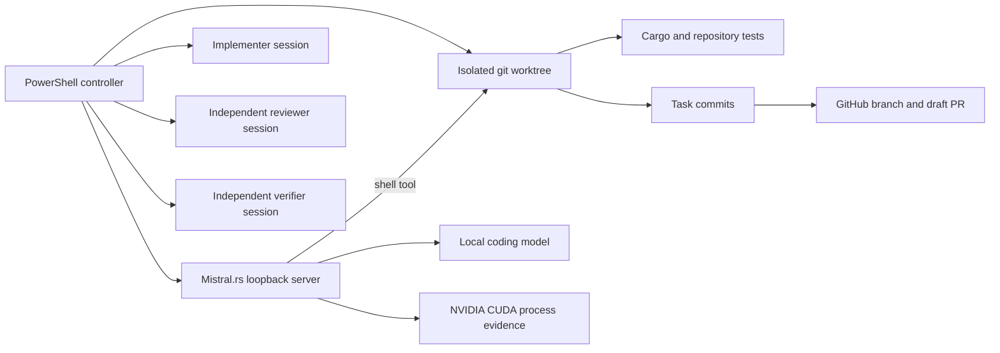

# 3DMk Local Mistral.rs Agent Experiment Design

**Status:** Approved by operator on 2026-08-07; CUDA invariant tightened on 2026-08-08  
**Scope:** Agent execution only  
**Product architecture:** Unchanged

## Decision

For this experiment, OpenCode is removed from the active execution path. The authoritative 3DMk implementation plan, branch discipline, Tauri 2 application architecture, Rust ownership rules, VWM boundaries, test requirements, and GitHub evidence requirements remain unchanged.

The replacement executor is a local Mistral.rs runtime using a locally cached model and Mistral.rs's server-side shell tool loop.

**CUDA execution is mandatory. No CPU fallback is permitted.** The harness must verify both static CUDA capability and live CUDA process evidence before the model can edit the repository.

## Runtime architecture

## Model policy

1. **Primary:** `Qwen/Qwen3-Coder-30B-A3B-Instruct`, 4-bit quantization.
   - Selected for agentic coding and tool calling.
   - The model has 30.5B total parameters and 3.3B activated parameters.
   - On the reference RTX 4050 6 GB system, Mistral.rs may map part of the quantized weights outside VRAM while retaining CUDA execution.
2. **Fallback:** `Qwen/Qwen3-8B`, 4-bit quantization.
   - Used automatically when the primary model cannot start within the available memory envelope.
   - The fallback changes model size only; it remains subject to the same CUDA gates.
3. **Smoke-test override:** `Qwen/Qwen3-4B`, 4-bit quantization.
   - Suitable for validating the live harness, not the preferred implementation model.
   - It is also CUDA-gated.
4. A local model directory may replace a Hugging Face model ID through a script parameter.

## Mistral.rs policy

- Bind only to `127.0.0.1`.
- Use the OpenAI-compatible Responses API and its `shell` tool.
- Use `pwsh.exe` as the shell on Windows.
- Set the shell working directory to the isolated 3DMk worktree.
- Run headlessly; the built-in web UI is disabled.
- Use bounded tool rounds and command timeouts.
- Keep the server alive for implementer, reviewer, and verifier sessions so the model is loaded once.
- Require `mistralrs doctor` to report the `cuda` build feature.
- Require `mistralrs doctor` to report a detected CUDA toolkit and NVIDIA driver.
- Prefer a native Windows source build using `cuda flash-attn cudnn`.
- Retry with the `cuda` feature alone if optional CUDA integrations do not compile.
- Require the live Mistral.rs PID to appear in the NVIDIA CUDA compute-process table after the model endpoint becomes ready.
- Write the observed process row to `.local-agent/task-XX/cuda-runtime-evidence.json`.
- Stop rather than use a non-CUDA executor.
- Do not use Docker, Podman, WSL, Electron, or a cloud model.

Mistral.rs does not currently provide a native Windows Vulkan/WebGPU inference backend that satisfies this experiment. The harness must not claim otherwise.

## CUDA evidence model

The controller uses three independent gates:

1. **Compiled capability** — `mistralrs doctor` identifies `cuda` among the compiled features.
2. **Host capability** — `mistralrs doctor` and `nvidia-smi` identify a usable NVIDIA CUDA environment.
3. **Runtime use** — after `/v1/models` becomes ready, `nvidia-smi --query-compute-apps` must return the exact Mistral.rs server PID.

The third gate prevents a CUDA-capable binary from silently satisfying the experiment while the active model server is not using the GPU.

## Execution topology

Each plan task uses three independent Mistral.rs sessions:

### Implementer

- Reads `AGENTS.md`, the progress ledger, and the authoritative plan.
- Executes only the selected dependency-ready task.
- Uses test-driven development.
- Updates the evidence ledger.
- Commits the task locally.
- Does not merge or force-push.

### Reviewer

- Reads the task requirements and complete task diff.
- Verifies specification compliance and code quality.
- Must not modify tracked repository files.
- Writes a structured `VERDICT: PASS` or `VERDICT: FAIL` report under the ignored local-agent workspace.

### Verifier

- Runs fresh commands from the task and governing repository contracts.
- Checks branch, cleanliness, tests, formatting, and task-specific evidence.
- Must not modify tracked repository files.
- Writes a structured `VERDICT: PASS` or `VERDICT: FAIL` report.

A failed review or verification result is returned to a fresh implementer repair session. The controller permits at most three repair rounds before reporting `BLOCKED`.

## Isolation and GitHub synchronization

- The controller resolves or creates the mandated branch `agent/vwm-authoritative-revision-implementation` in an isolated worktree.
- It refuses to run on `main` or `master`.
- It refuses to start with tracked or untracked changes.
- It records the base commit before implementation.
- A task is pushed only after CUDA runtime, reviewer, and verifier evidence pass.
- The controller creates or updates a draft PR through the authenticated GitHub CLI when available.
- It never merges the PR.

## Safety controls

The local model receives arbitrary shell access inside the dedicated worktree. Safety therefore comes from containment and evidence rather than from trusting the model:

- dedicated worktree;
- non-default implementation branch;
- loopback-only inference server;
- mandatory CUDA diagnostics and live-process evidence;
- bounded tool rounds and timeouts;
- pre- and post-session git status checks;
- independent reviewer and verifier sessions;
- no direct merge;
- no `git reset --hard`, `git clean`, force push, or branch deletion;
- no secrets in prompts or repository files.

## Experiment success criteria

The executor experiment passes when all of the following are evidenced:

1. Mistral.rs reports the selected local model ready on the loopback endpoint.
2. CUDA compilation and NVIDIA host detection pass.
3. The exact server PID is present in `cuda-runtime-evidence.json` from a live NVIDIA compute-process query.
4. The implementer reads the repository contracts and produces a task commit on the mandated branch.
5. The reviewer inspects the complete task diff and emits a structured verdict.
6. The verifier runs the required commands and emits a structured verdict.
7. The progress ledger contains commands and observed outcomes.
8. The branch is pushed and a draft PR exists.
9. No OpenCode credential or OpenCode runtime is required.

The experiment does not itself prove the broader 17-task plan complete.